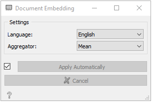
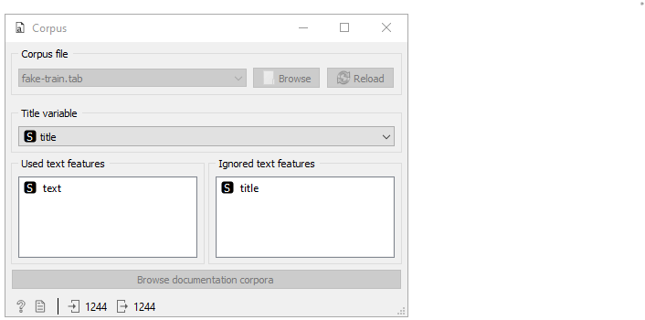
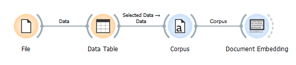
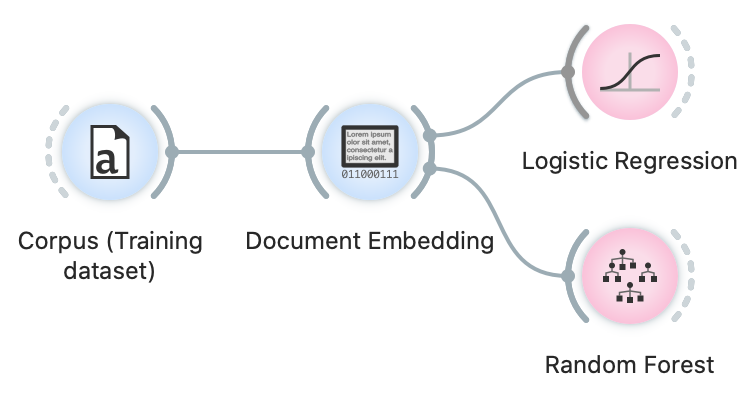
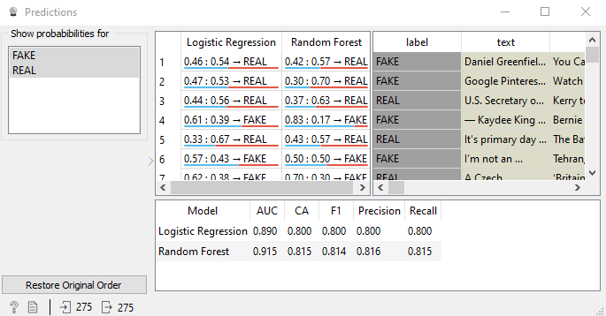
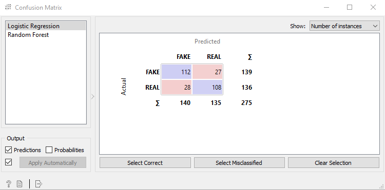

# Embeddings de documentos

Neste tutorial abordaremos de uma forma prática como usar embedding de documentos criando um identificador de notícias falsas.

Word embedding ou Incorporação de palavra, é uma representação de uma palavra em espaços multidimensionais, de forma que palavras com significados semelhantes tenham uma incorporação(valor) semelhante. Isso significa que cada palavra é mapeada para o vetor de números reais que representa a palavra. Os modelos de incorporação baseiam-se principalmente em redes neurais.

A incorporação de documentos é calculada em duas etapas. Primeiro, cada palavra é incorporada com o word embedding, em seguida, os word embeddings são agregados. O tipo mais comum de agregação é a média de cada dimensão.

Em comparação com o Bag of words, que conta o número de aparições de cada token no documento, os embeddings têm duas vantagens principais:

Eles não têm um problema de dimensionalidade. O resultado do Bag of words é uma tabela que possui o número de recursos igual ao número de tokens exclusivos em todos os documentos de um corpus. Textos longos resultam em um grande número de tokens exclusivos. Isso resulta em tabelas enormes que podem exceder a memória do computador. Essas tabelas também aumentam o tempo de aprendizado e avaliação dos modelos de aprendizado de máquina. Embedders têm dimensionalidade constante do vetor, que é 300 para embeddings fastText que Orange usa.
A maior parte do pré-processamento não é necessária. No caso da abordagem do saco de palavras, resolvemos o problema de dimensionalidade com o pré-processamento do texto onde removemos os tokens (por exemplo, palavras) que parecem ser menos importantes para a análise. Também pode causar a remoção de alguns tokens importantes. Ao usar embedders, não precisamos remover tokens, portanto, não estamos perdendo a precisão dessa forma. Além disso, a maior parte do pré-processamento básico pode ser omitida (como normalização) no caso de embeddings de fastText.
Eles podem ser pré-treinados. Os modelos de incorporação de palavras podem ser pré-treinados em grandes textos com bilhões de tokens. Dessa forma, eles capturam as características significativas da linguagem e produzem os embeddings de alta qualidade. Modelos pré-treinados são então usados ​​para obter embeddings de conjuntos de dados menores. Nosso widget de incorporação de documentos usa modelos fastText pré-treinados e é adequado para corpora(grandes textos) de qualquer tamanho.

A deficiência dos incorporadores é que eles são difíceis de entender. Por exemplo, quando usamos um bag of words, podemos facilmente observar quais tokens são importantes para a classificação com o widget Nomogram, pois os próprios tokens são recursos. No caso de embeddings de documentos, os recursos são números que não são compreensíveis por si só.

A Orange agora oferece incorporadores de documentos por meio do widget Document Embedding. Decidimos usar fastText pretrained embedders, que suportam 157 idiomas. O widget de incorporação de documentos da Orange suporta atualmente os 31 idiomas mais comuns.

No widget, o usuário define o idioma dos documentos e o método de agregação - é como os embeddings para cada palavra em um documento são agregados em um embedding de documento.

Para este tutorial, usamos a amostra do conjunto de dados Fake News. A amostra do Dataset está disponível neste link:
http://file.biolab.si/datasets/fake.zip
É um arquivo zip que contém dois conjuntos de dados: conjunto de treinamento incluindo 2725 itens de texto e conjunto de teste com 275 itens. Cada item é um artigo rotulado como real ou falso.

Aqui, apresentamos uma identificação de notícia falsa. Primeiro, carregamos uma parte de treinamento do conjunto de dados com o widget Corpus. 

Depois que o conjunto de dados é carregado, certificamo-nos de que a variável de texto está selecionada no campo Recursos de texto usados. Isso significa que o texto nesta variável é usado na análise do texto. Quando o conjunto de dados é carregado, conectamos o widget Corpus ao widget Document embedder, que calculará os embeddings de texto. se der Run time error, tente puxar os dados pelo file e selecionar um número menor de dados.
Nosso workflow está assim até o momento:

No widget de Document embedder, verificamos se o idioma está definido como inglês, já que os textos neste conjunto de dados são em inglês. Usaremos agregação média neste experimento - é o mais padrão. Depois que documentos minuciosos são incorporados - o progresso da incorporação é mostrado com a barra ao redor do widget.

Quando os embeddings estiverem prontos, podemos treinar modelos. Neste tutorial, treinamos dois modelos - regressão logística e floresta aleatória. Usaremos configurações padrão para ambos os modelos.

Quando nossos modelos são treinados, preparamos os dados de teste. Para carregar dados de teste, usamos outro widget Corpus e o conectamos ao widget incorporador de documento. As configurações são as mesmas de antes. A única diferença é que desta vez carregamos parte do teste do conjunto de dados no segundo widget do Corpus. Para fazer previsões e inspecionar os resultados da previsão no conjunto de dados de teste, usamos o widget de previsão.

Na parte inferior do widget, inspecionamos as precisões. Na coluna com o nome CA (precisão de classificação), podemos observar que ambos os modelos apresentam desempenho em torno de 80%. Na tabela acima, podemos encontrar casos em que os modelos cometeram erros. Se selecionarmos as linhas, podemos verificá-las no widget Corpus Viewer que está conectado ao widget Predictions. Também conectamos o widget de matriz de confusão ao nosso fluxo de trabalho, que mostra as proporções entre as classes previstas e classes reais.

Podemos ver que a regressão logística é um pouco mais precisa em casos de notícias reais, enquanto o modelo de floresta aleatória é melhor para prever notícias falsas.

É apenas um exemplo que mostra como usar embeddings de documentos. Você também pode usá-los para outras tarefas, como agrupamento, regressão ou outros tipos de análise.
