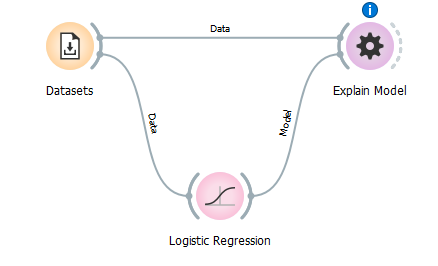
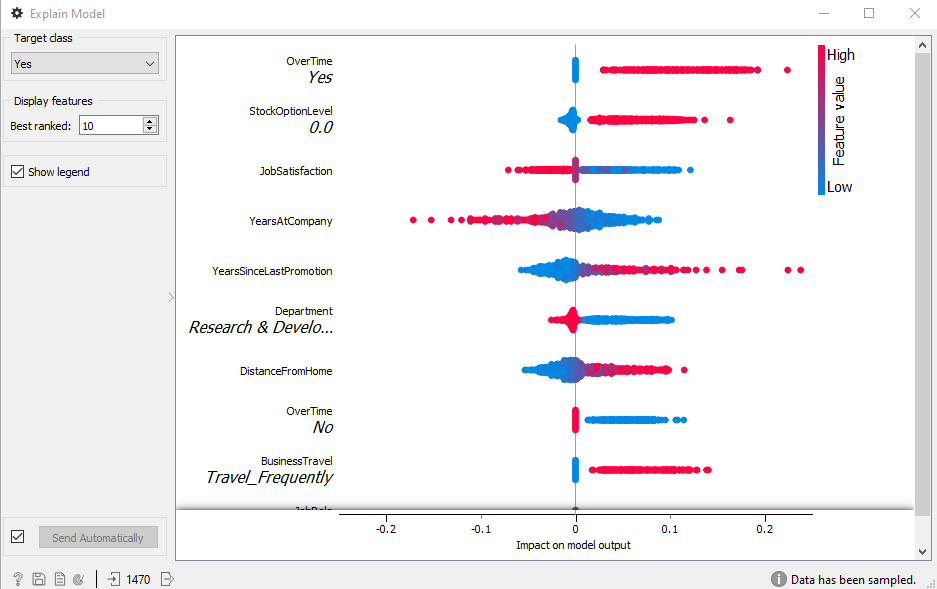
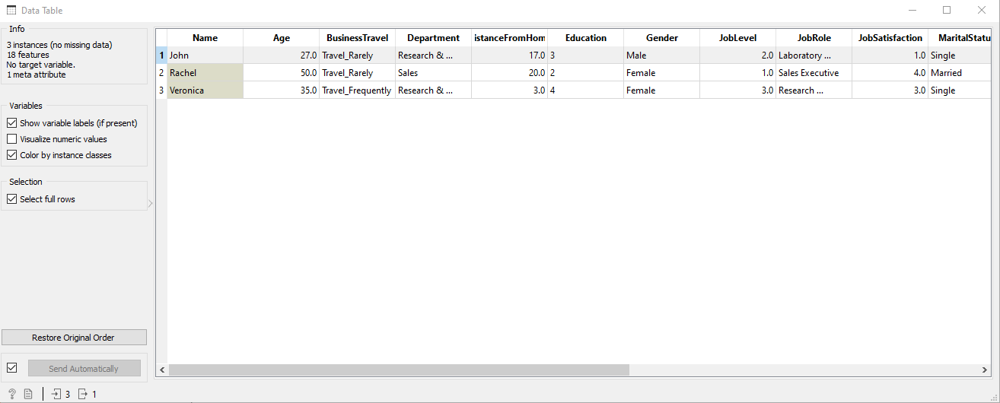
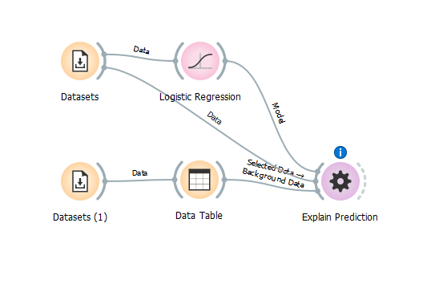
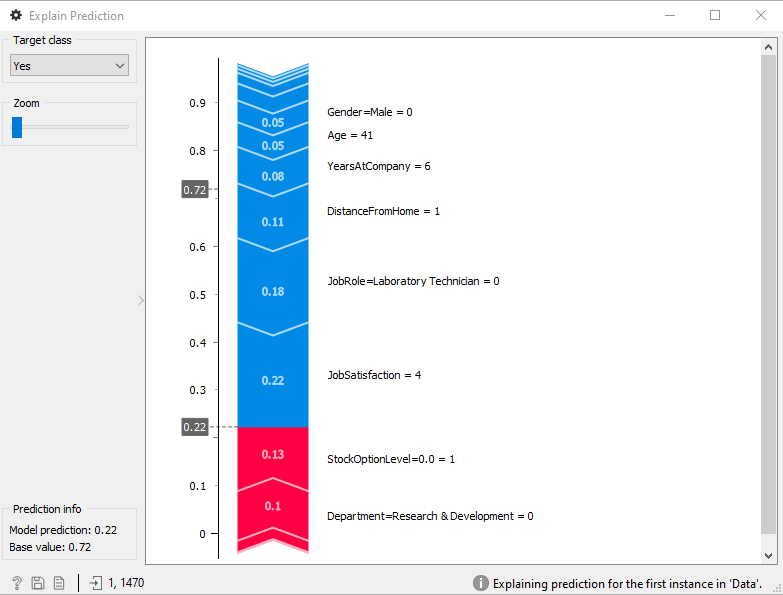

# Explicando modelos preditivos

É muito fácil construir modelos de predição no orange. Porém, como sabemos quais os atributos e quais valores desses atributos são importantes, e quais deles contribuíram para a decisão do algoritmo? O novo add-on Explain do Orange ajuda você a responder essas questões. Clique em Options, Add-ons e instale o Explain. Reinicie o Orange para que o add-on apareça. 

Vamos começar com o conjunto de dados de atrito do widget Datasets. Selecione o Attrition - Train, que é um conjunto de dados sobre quais funcionários pediram demissão da empresa e quais ficaram. A variável de destino é chamada de Atrito, onde não significa que o funcionário ficou e sim que o funcionário pediu demissão. Os outros atributos descrevem o funcionário - sua posição, educação, departamento, anos desde a promoção e assim por diante.

table

A seguir, construiremos um modelo preditivo de regressão logística simples. Ao inspecionar o modelo em Test and Score, descobrimos que o modelo tem uma AUC de 0,788 e 86% CA. Mas que tipo de modelo é esse? Como ele toma suas decisões?

Vamos adicionar Explain Model to Logistic Regression e adicionar outra conexão passando os dados. O fluxo de trabalho deve ser assim:

work

Agora abra o Explain Model. O widget lista as principais variáveis classificadas, o que significa que são as que mais contribuem para a variável target selecionada. Como estamos tentando entender por que as pessoas deixam a empresa, definimos o target como Sim.

A variável com classificação mais alta é OverTime - esta é a variável com maior impacto na previsão. Ter um valor Sim no atributo categórico OverTime (pontos vermelhos à direita) significa que o funcionário provavelmente vai pedir demissão. Além disso, ter baixa satisfação no trabalho (Low Satisfaction) contribui para o atrito (valores em azul à direita). A visualização mostra os valores que têm um grande impacto na previsão da turma selecionada à direita e aqueles que votam contra a classe selecionada à esquerda. A cor do ponto representa o valor do atributo (vermelho para valores maiores e azul para menores).

model

Vejamos, por exemplo, YearsAtCompany. Como interpretaremos isso? A variável tem mais pontos vermelhos à esquerda, o que significa que valores altos de variáveis contribuem contra o target (contra o atrito, ou seja, os funcionários ficarão). Os pontos vermelhos referem-se ao valor do atributo. Portanto, se o funcionário está na empresa há muito tempo (valor alto == ponto vermelho), significa que é mais provável que ela permaneça (os pontos ficam à esquerda, enquanto nosso valor alvo é Sim).

Ótimo, agora entendemos o modelo e estamos prontos para fazer algumas previsões. Vamos carregar o Attrition - Predict com outro widget do Data Sets. Temos três novos funcionários, que são descritos com todas as variáveis anteriores, mas estão sem Atrito - não sabemos quem tem mais probabilidade de sair.

table2

Agora, ligue o modelo de regressão logística ao conjunto de dados de treino para Explain Predictions. Em seguida, selecione John na tabela e ligue a seleção para  Explain Predictions. O widget requer três entradas: o modelo, os dados de treinamento e a instância que estamos prevendo (John). 

work2

Mais uma vez, estamos interessados no valor target Sim. As variáveis em vermelho aumentam a probabilidade do valor alvo (inversamente, em azul o diminui). O tamanho da seta corresponde ao valor SHAP - em outras palavras, quanto maior a seta, maior a contribuição da variável para o valor alvo. O modelo também previu que a probabilidade de John deixar o emprego é de 22%.

last

Os resultados correspondem em grande parte aos do modelo, mas nem sempre é o caso. Algumas pessoas podem sair porque estão muito insatisfeitas sem trabalhar horas extras. Isso seria mostrado em Explain Predictions. Veja como os resultados mudam para as outras duas funcionárias, Rachel e Verônica. Ou invente seu próprio funcionário com o Excel e veja qual seria a previsão.

