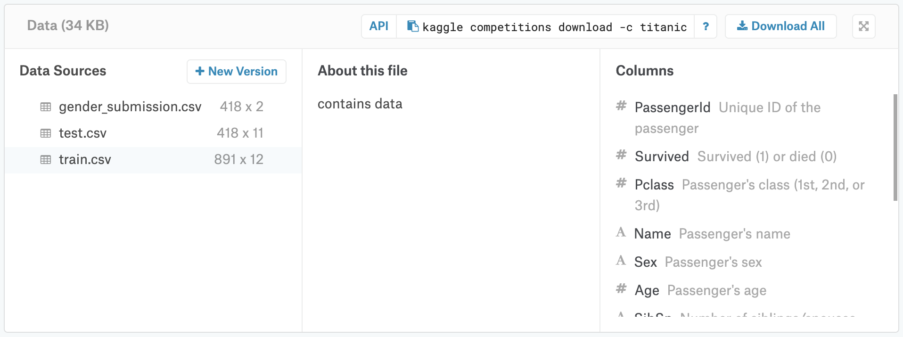
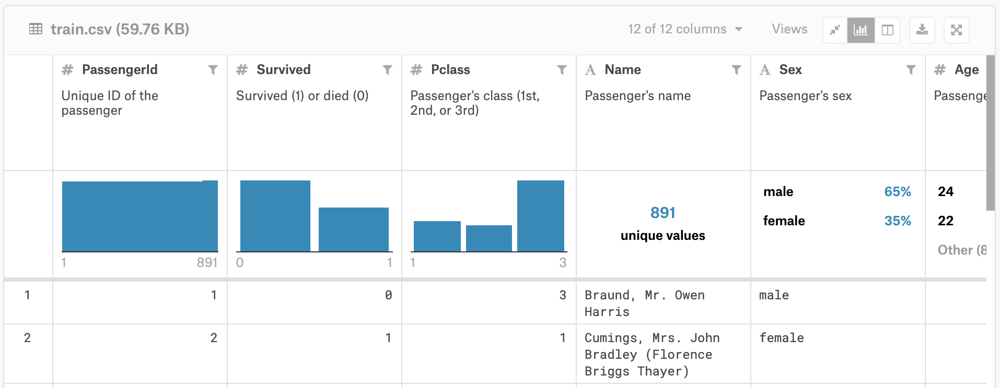
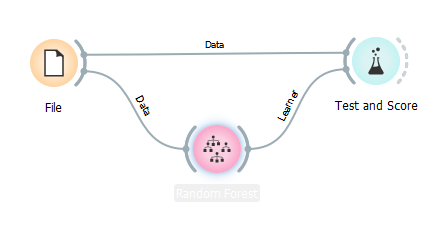

# Titanic Kaggle resolvendo problema simples da plataforma com orange

## Apresentando a plataforma Kaggle

Kaggle é uma comunidade online de cientistas de dados e profissionais de aprendizado de máquina. Nela, os usuários podem encontrar e publicar conjuntos de dados, explorar e construir modelos em um ambiente de ciência de dados baseado na web, trabalhar com outros cientistas de dados e engenheiros de aprendizado de máquina e participar de competições para resolver desafios de ciência de dados. Nela também podemos participar das competições que consistem em desafios onde você pode mandar sua solução, ou seja um modelo de predição, e assim, dependendo do quão bom sua solução for, subir no ranking e, dependendo de qual, as competições têm grandes prêmios em dinheiro.

## Problema do titanic

Para esse tutorial utilizaremos o problema do titanic que é um problema simples achamos no kaggle pelo link. 
https://www.kaggle.com
na aba lateral em “Compete” encontramos os desafios, e na barra de search digitamos “Titanic” para achar o nosso.

A primeira coisa a fazer é entrar na competição! Abra uma nova janela com a página da competição e clique no botão "Join Competition", caso ainda não o tenha feito. (Se você vir um botão "Submit predictions" em vez de um botão "Join Competition", você já entrou na competição e não precisa fazer isso novamente.)

Isso leva você para a página de aceitação de regras. Você deve aceitar as regras da competição para participar. Essas regras regem quantas inscrições você pode fazer por dia, o tamanho máximo da equipe e outros detalhes específicos da competição. Em seguida, clique em "Eu entendo e aceito" para indicar que você cumprirá as regras da competição.

## O desafio

A competição é simples: queremos que você use os dados do passageiro do Titanic (nome, idade, preço da passagem, etc) para tentar prever quem vai sobreviver e quem vai morrer.

## Os dados
Para ver os dados da competição, clique na guia Dados na parte superior da página da competição. Em seguida, role para baixo para encontrar a lista de arquivos.

//dados

Existem três arquivos nos dados: (1) train.csv, (2) test.csv e (3) gender_submission.csv.

(1) train.csv
train.csv contém os detalhes de um subconjunto de passageiros a bordo (891 passageiros, para ser exato - onde cada passageiro obtém uma linha diferente na tabela). Para investigar esses dados, clique no nome do arquivo na coluna "Fontes de dados" (à esquerda da tela). Depois de fazer isso, todos os nomes das colunas (junto com uma breve descrição do que contêm) são listados à direita da tela, sob o título "Colunas".

// train1

Você pode ver todos os dados na mesma janela.

// train2

Os valores na segunda coluna ("Sobreviveu") podem ser usados ​​para determinar se cada passageiro sobreviveu ou não:

se for um "1", o passageiro sobreviveu.
se for um "0", o passageiro morreu.
Por exemplo, o primeiro passageiro listado em train.csv é o Sr. Owen Harris Braund. Ele tinha 22 anos quando morreu no Titanic.

(2) test.csv
Usando os padrões que você encontra em train.csv, você deve prever se os outros 418 passageiros a bordo (em test.csv) sobreviveram.

Clique em test.csv (na coluna "Data Sources") para examinar seu conteúdo. Observe que test.csv não tem uma coluna "Survived" - essa informação está escondida de você, e quão bem você se sai na previsão desses valores ocultos determinará sua pontuação na competição.

(3) gender_submission.csv
O arquivo gender_submission.csv é fornecido como um exemplo que mostra como você deve estruturar suas previsões. Prevê que todos os passageiros do sexo feminino sobreviveram e todos os passageiros do sexo masculino morreram. Suas hipóteses sobre a sobrevivência provavelmente serão diferentes, o que levará a um arquivo de envio diferente. Mas, assim como este arquivo, seu envio deve ter:

uma coluna "PassengerId" contendo os IDs de cada passageiro em test.csv.
uma coluna "Survived" com um "1" para as linhas onde você acha que o passageiro sobreviveu e um "0" onde você prevê que o passageiro morreu.

Para concluir precisamos ter uma base em jupyter notebook, mas, para esse tutorial utilizaremos o Orange para tentar reproduzir uma previsão.

Pegamos o “train.csv” por meio do widget File,  conectamos ao modelo de predição Random Forest e linkamos ao test and score. configurando no seguinte workflow

//workflow

O teste ao invés de feito no “test.csv” será feito no próprio “train.csv” com 70% dos dados para treinar e o restante para testar, assim em test score podemos ver o resultado.

//score

em uma versão mais avançada, feita no notebook jupyter, poderíamos enviar nosso resultado para o kaggle, além de melhorar por meio de mineração de dados e outras técnicas disponíveis nas bibliotecas usada no jupyter. Faremos isso no próximo tutorial.
