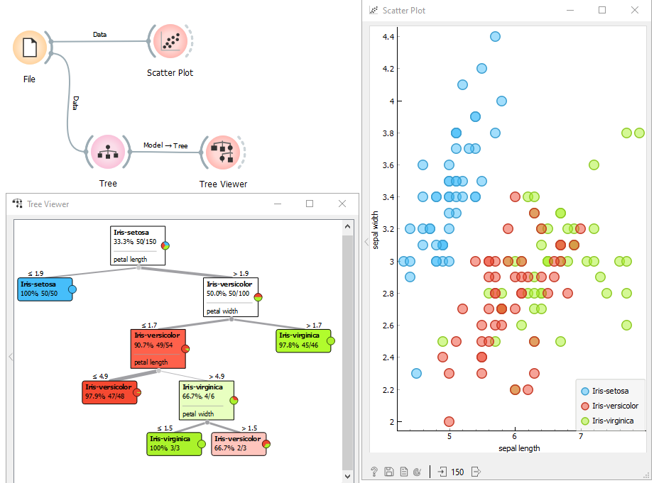
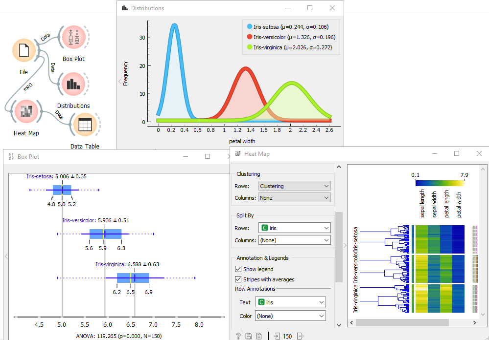
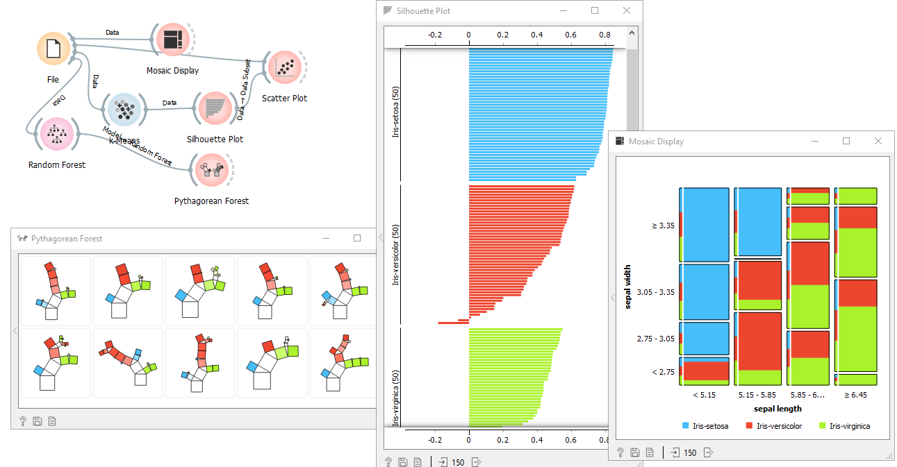
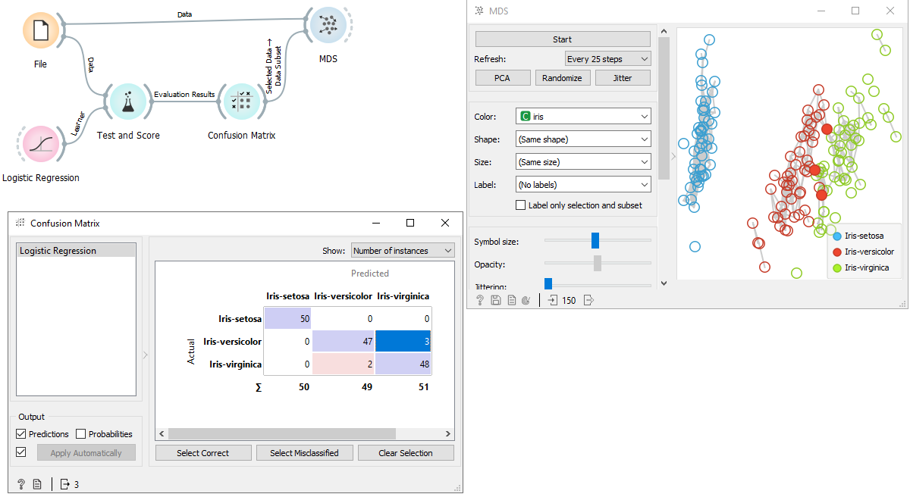
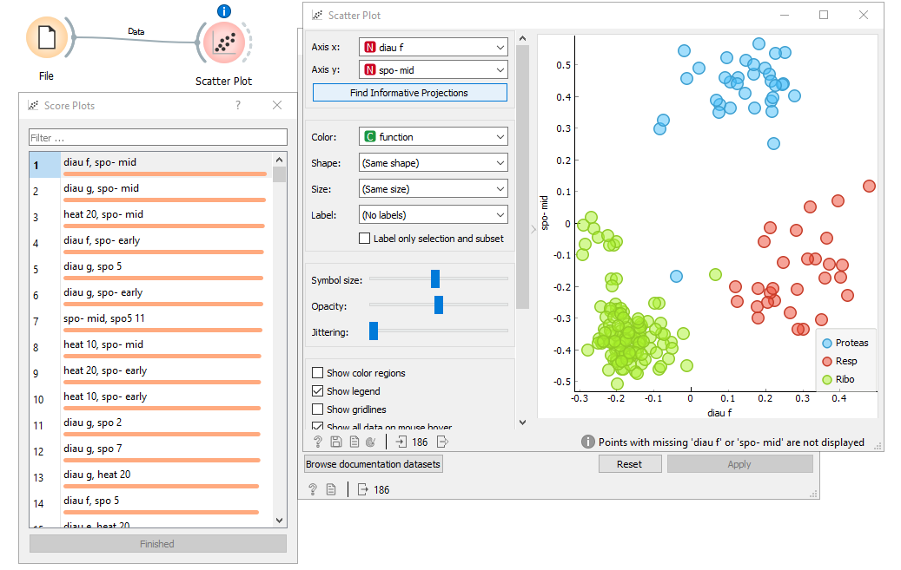

# Formas de visualização de dados

Neste tutorial mostraremos os tipos de visualização de dados que o orange proporciona e suas respectivas importâncias e usabilidades.

Orange tem tudo a ver com visualizações de dados que ajudam a descobrir padrões de dados ocultos, fornecem intuição por trás dos procedimentos de análise de dados ou apóiam a comunicação entre cientistas de dados e especialistas no domínio. Os widgets de visualização incluem scatter plot, box plot, histograma e visualizações específicas do modelo, como dendrogram, silhouette plot, e tree visualizations, apenas para citar alguns. Muitas outras visualizações estão disponíveis em add-ons e incluem visualizações de redes, nuvens de palavras, mapas geográficos e muito mais.

O orange toma o cuidado  de deixar as informações interativas: você pode selecionar pontos de dados em um gráfico de dispersão, um nó na árvore, um ramo no dendrograma. Qualquer dessas interações instruirá a visualização a enviar um subconjunto de dados que corresponde à parte selecionada da visualização. Considere a combinação de um gráfico de dispersão e árvore de classificação abaixo. O gráfico de dispersão mostra todos os dados, mas destaca o subconjunto de dados que corresponde ao nó selecionado na árvore de classificação.

### Visualizações

Orange inclui muitas visualizações padrão. O Scatter plot é ótimo para visualizar correlações entre par de atributos, Box plot para exibir estatísticas básicas, Heatmap para fornecer uma visão geral de todo o conjunto de dados e gráficos de projeção como MDS para plotar os dados multinomiais em duas dimensões.

Além das visualizações que se esperariam em um pacote de mineração de dados, o Orange inclui alguns ótimos extras que você pode não encontrar em outros pacotes. Isso inclui widgets para silhouette plot para analisar os resultados de clustering, mosaic e Sieve diagramas para descobrir interações de recursos e visualização de árvore pitagórica para classificação de árvores e forests.

### Mexendo com Análise de dados

As visualizações interativas permitem a análise exploratória de dados. Pode-se selecionar subconjuntos de dados interessantes diretamente de plotagens, gráficos e tabelas de dados e minerá-los nos widgets downstream. Por exemplo, selecione um cluster do dendrograma de agrupamento hierárquico e mapeie-o para uma apresentação de dados 2D no gráfico MDS. Ou verifique seus valores na tabela de dados. Ou observe a distribuição dos valores de seus recursos em um gráfico de caixa. Abra todas essas janelas de uma vez e veja como as mudanças em sua seleção afetam outros widgets. Ou, para outro exemplo, faça a validação cruzada da regressão logística em um conjunto de dados e mapeie algumas das classificações erradas para a projeção bidimensional. É fácil transformar o Orange em uma ferramenta em que especialistas de domínio podem explorar seus dados, mesmo que não tenham insights sobre estatísticas subjacentes ou aprendizado de máquina.

### Visualizações inteligentes

Às vezes, existem muitas opções. Digamos, quando os dados têm muitos recursos, qual par de recursos devemos visualizar em um gráfico de dispersão para fornecer a maioria das informações? Para isso temos a visualização inteligente. No gráfico de dispersão do Orange, chamamos de Score Plots, que pode ser acessado clicando em Find Informative Projections. Quando as informações da classe são fornecidas, Score Plots encontra as projeções com a melhor separação de classes. Considere o conjunto de dados selecionado em marrom (vem com laranja) e seus 79 features. Existem 3.081 (79 * 78/2) pares de recursos diferentes, muitos para verificá-los manualmente, mas existem apenas algumas combinações de features que geram um ótimo gráfico de dispersão. Score Plots encontra todos eles e nos permite navegar por eles.

