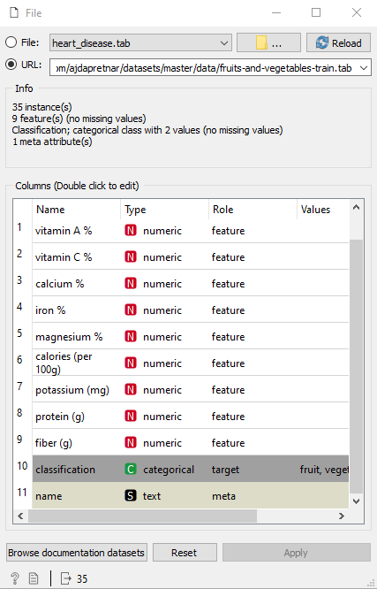
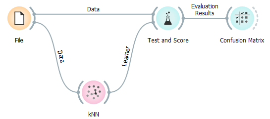
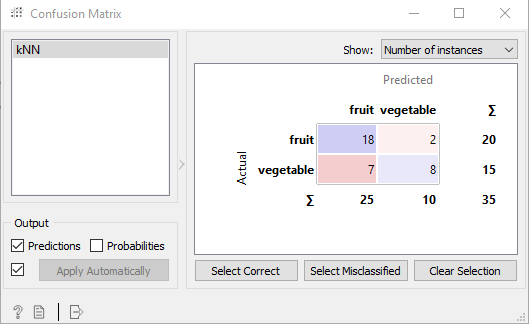
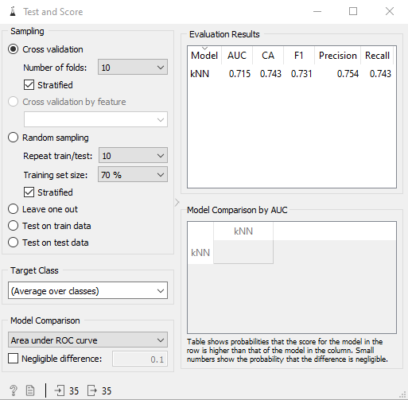

# Métricas de Classificação
video tutorial:https://www.youtube.com/watch?v=RfWSjvQxHhI

Neste tutorial falaremos sobre como saber se seu modelo de classificação está bom.
Para isso utilizamos ferramentas matemáticas, baseada na comparação entre o resultado real e os dados obtidos no treino, que retornam um valor cujo o significado será abordado mais à frente.
As métricas são:

### Criando um exemplo
Para exemplificar, usaremos um dataset para classificação de frutas e vegetais que pode ser obtido por este link:
https://raw.githubusercontent.com/ajdapretnar/datasets/master/data/fruits-and-vegetables-train.tab

Seguindo, podemos usar o modelo que preferirmos para realizar o treino. Utilizaremos o KNN. Linkando ele e nossa base de dados ao widget Test and score e ele ao Confusion matrix, temos o seguinte resultado:

Na matriz de confusão podemos ver o que o modelo acertou ou errou

Temos assim que, dos 35 dados analisados onde 20 eram frutas e 15 vegetais, nosso modelo acertou 18 frutas e 8 vegetais, por consequência confundiu 2 frutas com vegetais e 7 vegetais com frutas.

Em Test and score podemos ver cálculos que resumem essas informações em um valor numérico de porcentagem.

Focaremos agora em explicar as quatro métricas mais importantes: CA(Accuracy),F1,Precision e Recall.

Para isso usaremos termos referentes aos tipos de resultados encontrados pelo modelo:

- True positive (TP): indica a quantidade de registros que foram classificados como positivos corretamente.
- True negative (TN): indica a quantidade de registros que foram classificados como negativos de maneira correta.
- False positive (FP): indica a quantidade de registros que foram classificados como comentários positivos de maneira incorreta.
- False negative (FN): indica a quantidade de registros que foram classificados como comentários negativos de maneira incorreta.

Através desses quatro valores, seremos capazes de calcular os indicadores: Accuracy, Precision, Recall e F1 Score.

### Accuracy
A Accuracy é o indicador mais simples de se calcular. Ele é a divisão entre todos os acertos pelo total.

Esse indicador pode acabar enganando um avaliador. Para essa pontuação significar algo, de fato, é necessário que a base de dados que foi utilizada para avaliação tenha uma boa variedade de resultados.

Fique atento para os casos onde a base de dados utilizada para avaliação seja composta por majoritariamente um único tipo de resultado.

Usaremos um exemplo hipotético. Imagine que criamos um classificador para responder se um determinado exame contém ou não uma doença. Nesse cenário, nossa base de dados será composta por 90% de registros em que a doença não ocorre e apenas 10% de registros onde ocorre.

Imagine agora que nosso modelo sempre responde que não há doenças. Qual seria a Accuracy desse modelo?

Como nossa base é composta por 90% de registros onde de fato não há doença, nosso modelo teria uma Accuracy de 90%, mesmo ele sendo ruim.

### Precision
A Precision é utilizada para indicar a relação entre as previsões positivas realizadas corretamente e todas as previsões positivas (incluindo as falsas).
A métrica Precision nos dá informação sobre falsos positivos, então trata-se de identificar um determinado resultado de maneira precisa.
Imagine por exemplo, uma base de dados que contenha 1000 comentários, onde apenas 100 deles são positivo. Caso o modelo responda positivo apenas para um destes casos, a Precision ainda estaria 100%. Isso porque os falsos negativos não são considerados nessa métrica.

A principal utilização dessa métrica é para modelos onde é preciso minimizar os falsos positivos. Neste caso, quanto mais perto dos 100% chegarmos, melhor.

### Recall
A métrica Recall é utilizada para indicar a relação entre as previsões positivas realizadas corretamente e todas as previsões que realmente são positivas (True Positives e False Negatives). Essa métrica é capaz de responder a questão:
De todos os comentários que realmente são positivos, qual percentual é identificado corretamente pelo modelo?

A Recall nos dá informações sobre falsos negativos. Essa métrica por si só não é diretamente vinculada a classificar todos os casos corretamente. Ela indica o quanto nosso modelo está identificando os casos positivos corretamente.
A Recall é bastante útil quando precisamos minimizar os falsos negativos. Isso é especialmente útil para casos de diagnósticos, onde pode haver um dano muito maior em não identificar uma doença, do que identificá-la em pacientes saudáveis.
Sempre que precisarmos minimizar os falsos negativos devemos buscar uma maior pontuação nessa métrica.
### F1 Score
De forma bastante simples, ela é uma maneira de visualizarmos as métricas Precision e Recall juntas.

Uma maneira de unir as duas métricas seria simplesmente calcular a média aritmética. O problema disso é que existem casos onde a Precision ou a Recall podem ser muito baixas enquanto a outra permanece alta.

Isso indicaria problemas na geração de falsos positivos ou negativos, conforme já vimos nos tópicos anteriores. Para ajustar isso, o cálculo é um pouco diferente, mas ainda acaba sendo uma média entre as duas métricas anteriores.

A média que iremos calcular é a média harmônica, quando os dois valores do cálculo são iguais. Essa média gera resultados muito próximos da média “comum”.

No entanto, sempre que os valores são diferentes, essa média se aproxima mais dos valores menores.

