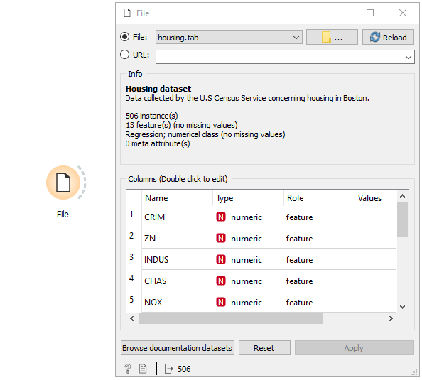
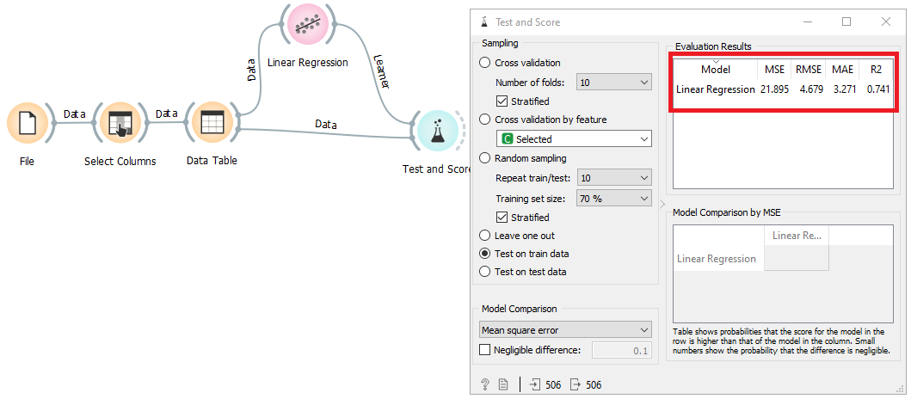
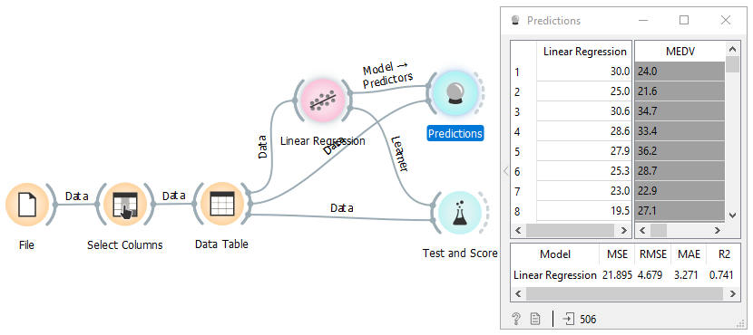

### Avaliação de modelo / Métricas de Regressão
video tutorial:https://www.youtube.com/watch?v=wQ8_BI5K074

Algo essencial em ciência de dados é saber se seu modelo de predição é bom o suficiente para ser utilizado. Para isso são utilizados cálculos matemáticos baseados na resposta do modelo dada uma determinada entrada.
À primeira vista os termos parecem algo difícil de compreender mas hôje entenderemos a fundo como isso funciona para modelos de regressão.
O modelo regressão linear pode ser um exemplo típico deste tipo de problema, e a principal característica do problema de regressão é que os alvos de um conjunto de dados contêm apenas os números reais.

Aqui temos um exemplo usando o famoso data base housing, onde tentamos prever o preço da casa usando informomações do local onde esta situada e instâncias associadas a este local. Usamos 70% dos dados para treinar o restante. Linkando ele ao test and score teremos os resultados de avaliação.

Como resultado temos as medidas de precisão do nosso modelo.

## Medidas de acuracia para modelos de regressão

São elas MAE, MSE, RMSE, R-squared 

MAE (erro médio absoluto) representa a diferença entre os valores originais e preditos extraídos pela média da diferença absoluta sobre o conjunto de dados.

MSE (erro quadrático médio) representa a diferença entre os valores originais e previstos extraídos ao quadrado da diferença média sobre o conjunto de dados.

RMSE (Root Mean Squared Error) é a taxa de erro pela raiz quadrada de MSE.

R-quadrado (coeficiente de determinação) representa o coeficiente de quão bem os valores se ajustam em comparação com os valores originais. O valor de 0 a 1 interpretou as porcentagens. Quanto maior for o valor, melhor será o modelo.

De uma forma mais visual temos:

Para termos uma ideia podemos comparar o resultado da predição com o valor real. Com o widget Predictions temos tanto as acurácias quanto o resultado do modelo

Como podemos ver, a diferença entre o predito e o real no primeiro valor é de 6 pontos, porém a diferença média de erro segundo o modelo é representado pelo MAE de 21,89. ou seja, o valor de cada casa variou em media com essa diferença pra cima ou para baixo.

Esse tutorial é baseado na pagina
https://www.datatechnotes.com/2019/02/regression-model-accuracy-mae-mse-rmse.html
onde poderá ver informações e exemplos baseados em R.
