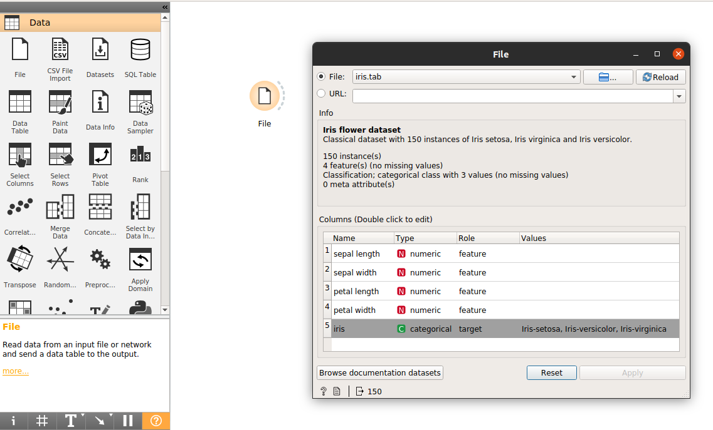
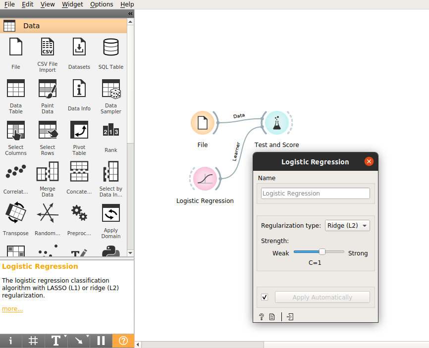
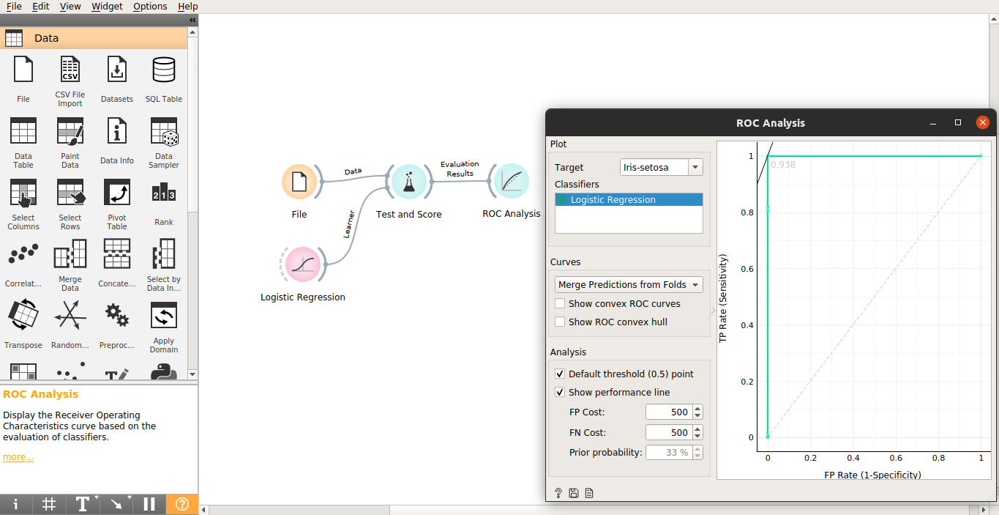

# Logistic Regression e Análise ROC

Neste tutorial explicamos o que é a regressão logística e a análise ROC com foco no uso dessas ferramentas para criar um modelo de predição.
Primeiramente explicaremos como esses modelos funcionam.
A regressão logística fornece como resposta a probabilidade de algo pertencer a uma determinada classe, ou seja, a saída é “sim” ou “não”. Por isso, mesmo nos dando um valor numérico, se torna um modelo categórico.

Podemos entender regressão logística como o uma regressão linear para problemas de classificação. Esse tipo de problema surge quando queremos categorizar alguma variável por classes. A regressão logística sempre nos fornecerá uma previsão sempre entre 0 e 1, o que é perfeito para problemas de classificação. Ela não é influenciada por outliers.

Essa imagem exemplifica o funcionamento do modelo, a linha tracejada representa o limiar da classificação. O que vier antes pode ser classificado de uma forma e o que vier depois de outra, por isso só admite dois possíveis valores.

Para iniciar usaremos, no orange, o data set iris.tab, que descreve plantas por suas propriedades físicas.

Assim, conectamos o data set e o widget Logistic Regression ao Test and Score

Podemos alterar o limiar da regressão logística por meio do atributo Strength aumentando uma quantidade de resultados “A” e diminuindo “B”.

O widget ROC Analysis plota uma taxa de verdadeiro positivo em relação a uma taxa de falso positivo de um teste. O eixo X representa a taxa de falso positivo, enquanto o eixo Y representa a taxa de verdadeiro positivo. Em outras palavras, um bom modelo terá a maioria dos pontos no canto superior esquerdo, exatamente como o que temos na figura abaixo.

