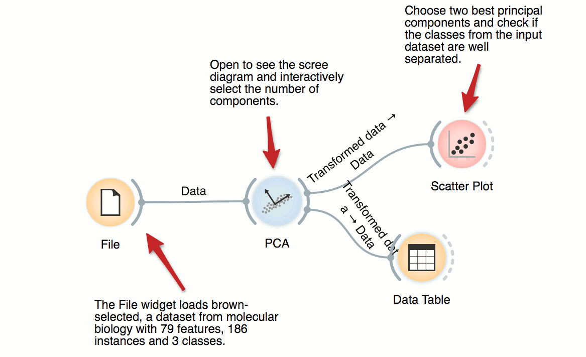
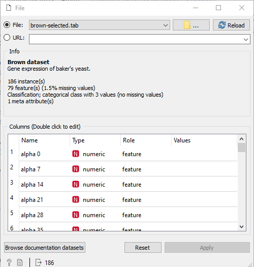
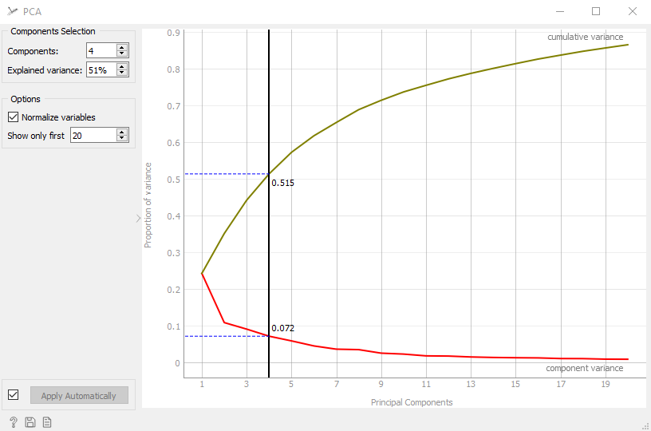
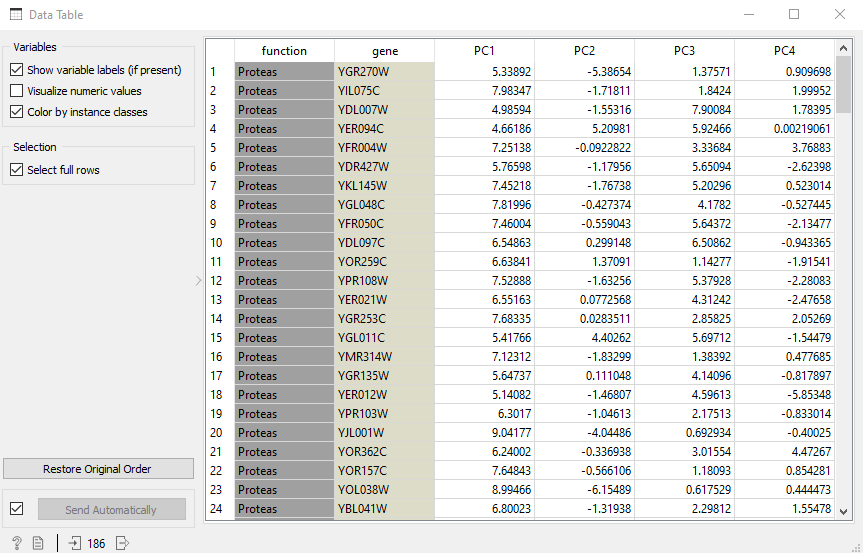

# Principal Component Analysis(PCA) - o que é e aplicações

PCA, em portugues análise de componentes principais, é um método que tem a finalidade de analisar os dados usados visando sua redução, eliminação de sobreposições e a escolha das formas mais representativa de dados a partir de combinações lineares das variáveis originais.

É possível que algumas features sejam derivadas de outras (no caso de um gato por exemplo: sua altura e largura sejam diretamentes ligadas a seu peso) então essa seria uma possível candidata a ser retirada a fim de diminuir as dimensões de nossa representação sem perder informações importantes

A análise de componentes principais (PCA) é uma maneira de identificar a
relação entre características extraídas dos dados. É bastante útil quando os vetores de
características têm muitas dimensões, quando uma representação gráfica não é possível,
mas também pode ser útil em dimensões menores.

Para exemplificar utilizaremos o Dataset brown-selected que, basicamente, são dados sobre a expressão gênica de fermento de pão.

Usaremos um Workflow do site do Orange para esse exemplo, caso queira baixar, segue o link: https://orange.biolab.si/tags/Dimensionality-Reduction/

Nosso dataset é composto de 3 classes e 78 features, que serão resumidas em 4 pca´s

em PCA podemos ver e decidir o número de features que utilizaremos
movendo a linha preta no eixo Y podemos alterar esse número, resumindo toda a informação porém perdendo parte dela. Usaremos apenas 4, o que só cobre 51% das informações.
A opção normalize variables ajusta todos os valores para uma escala só.

Como resultado, no datatable teremos uma tabela com a descrição dos 4 pca´s

Análise dos Componentes Principais (PCA) é um método estatístico linear que
encontra os autovalores e autovetores da matriz de covariância dos dados e, com esse
resultado, pode-se realizar a redução dimensional dos dados e analisar os padrões
principais de variabilidade presentes.

PCA é um método exploratório porque auxilia na elaboração de hipóteses gerais
a partir dos dados coletados, contrastando com estudos direcionados nos quais hipóteses
prévias são testadas. É também é capaz de separar a informação importante da
redundante e aleatória.
A PCA também é muito utilizada em algoritmos de compressão de imagens.
A característica básica da PCA é a redução do espaço necessário para a representação da
imagem, já que a PCA promove uma compactação da energia.

Com o emprego da PCA a visualização de diversas variáveis em um
determinado conjunto de dados torna-se mais produtiva, rápida, objetiva e eficiente.

Para informações mais aprofundadas na parte matematica do PCA acesse
http://www2.ic.uff.br/~aconci/PCA-ACP.pdf

