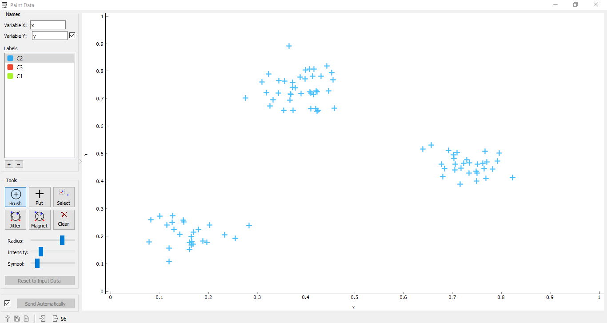
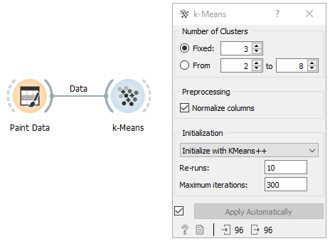
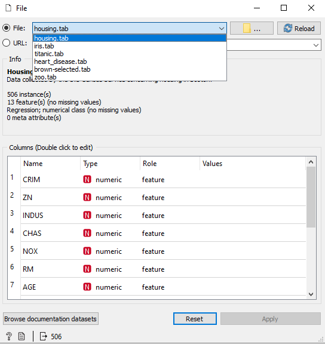
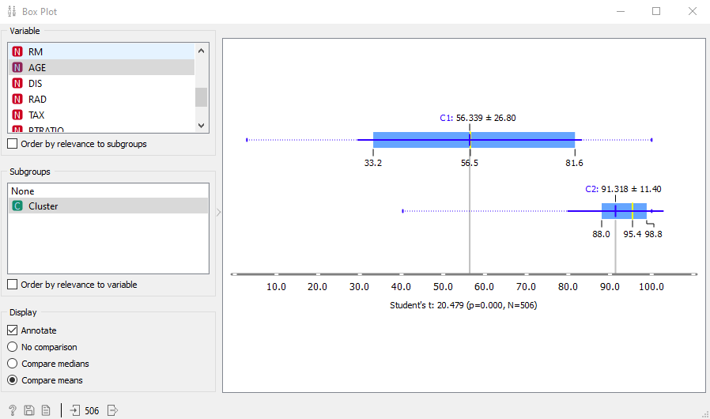
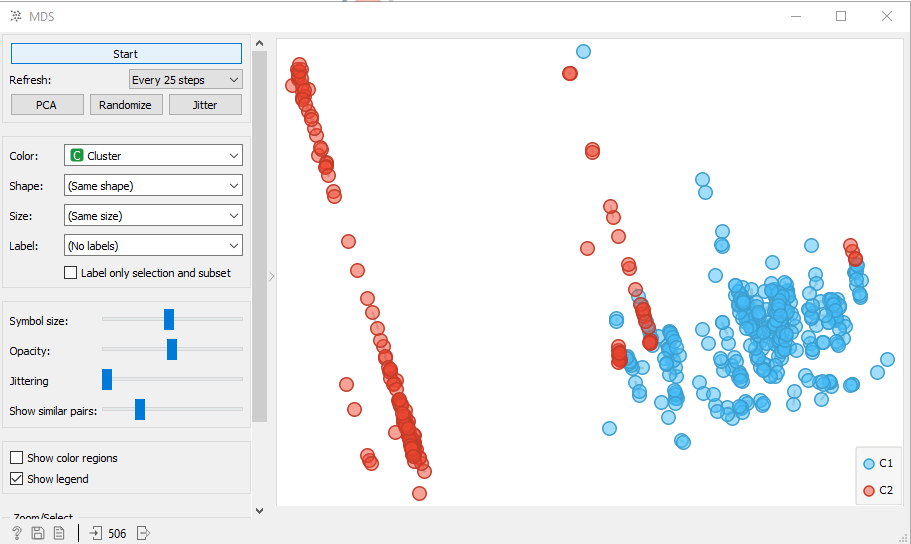

# Clusterização e k-means

Hoje falaremos sobre como agrupar dados usando o método K-means, que é um algoritmo de clusterização que separa os dados baseados nas diferentes distâncias entre grupos de dados. Esse tutorial é baseado em um vídeo do grupo criador do Orange: https://www.youtube.com/watch?v=vgmL808eSw4

Para iniciar, utilizaremos o widget Paint data.

Nele criamos dados fictícios para serem testados. Espalhamos os dados pelo mapa em conjuntos para que o k-means possa identificar como irá dividir esses grupos.

Agora ligamos ao widget K-Means para executar o algoritmo de clusterização.

Em fixed configuramos para dividir nossos dados em 3 clusters da mesma forma que fizemos na pintura dos dados.
Assim, conectamos o widget Scatterplot para visualizarmos como ficou.

Os dados também podem ser clusterizados baseados em uma pontuação que dará como saída o número certo de clusters a serem feitos que chamamos de silhouette, que é um algoritmo dentro do K-Means que mostra o quão bem cada dado cabe em um certo cluster.

Para exemplificar em um exemplo real utilizaremos o dataset housing que mostra um conjunto de dados sobre casas como preço idade da casa entre outros.

Conectamos o dataset ao K-Means, selecionamos dois clusters e utilizaremos, ligado ao K-Means, dois widgets para visualização desses clusters:Boxplot e MDS.

Em Boxplot vemos como foi a divisão dos clusters. Selecionamos AGE que nos dará a idade da casa.

Podemos visualizar essa divisão no gráfico. O widget MDS nos dá uma projeção de dados bidimensionais por escala multidimensional construída a partir de uma matriz de distância.

Assim, vemos que, dada a disparidade dos dados, a divisão foi feita.
