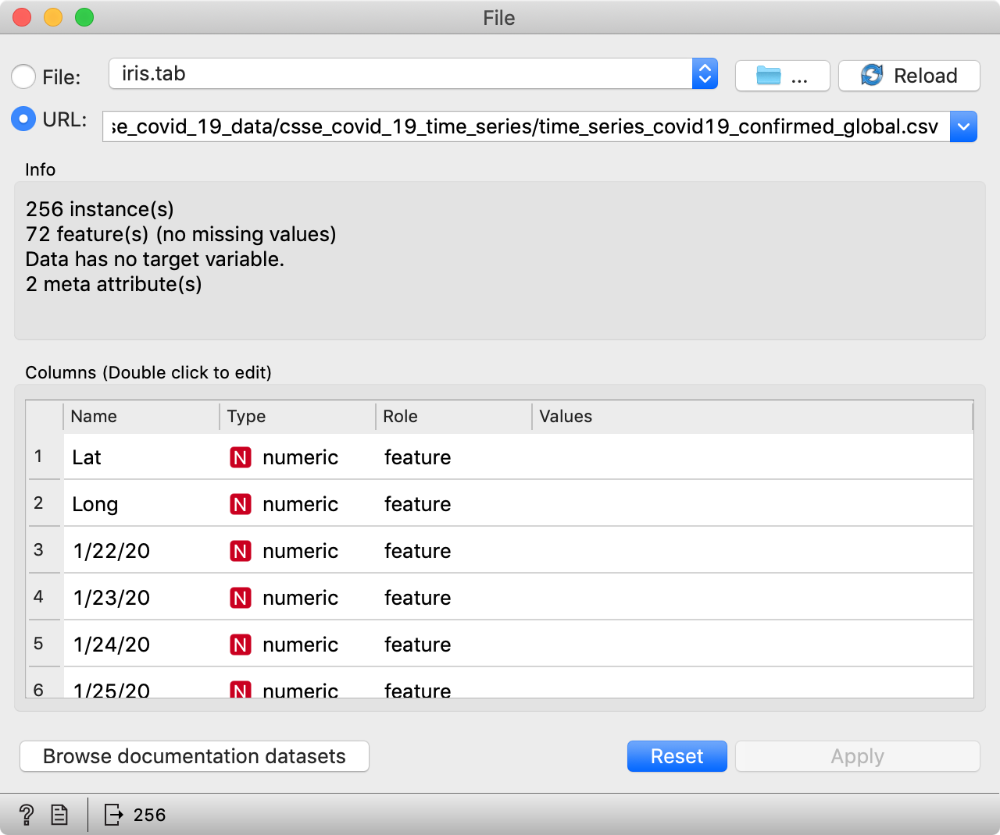
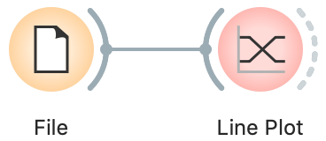
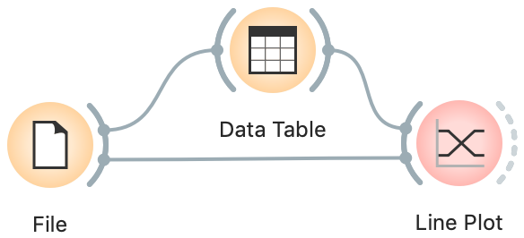
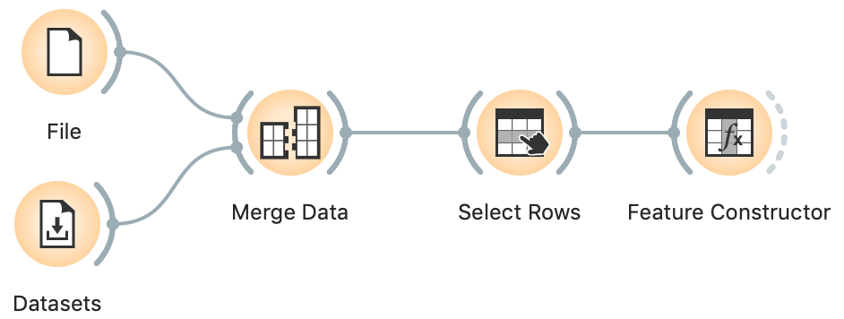
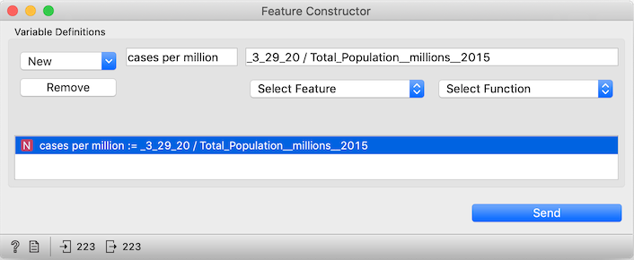
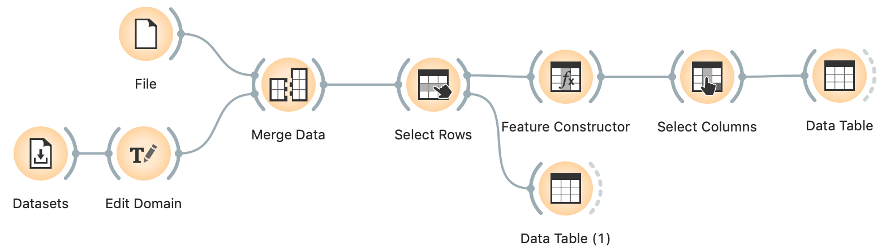
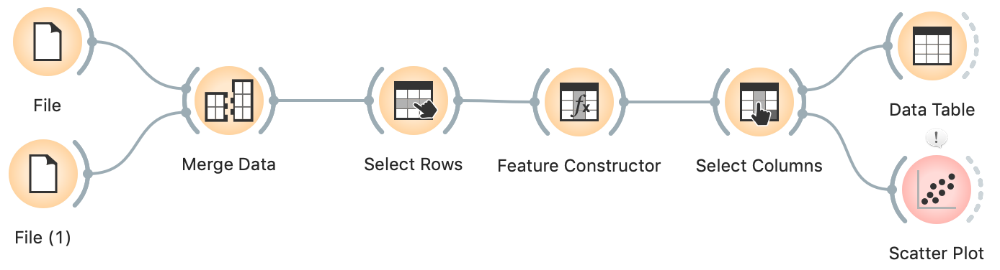
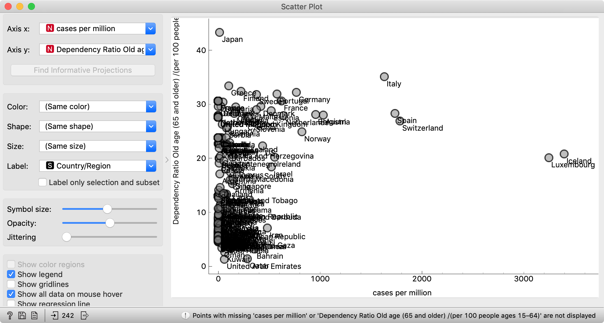

# Analize de dados covid-19 utilizando Orange
Hoje, veremos como colocar dados em Orange, desenhar algumas curvas básicas e relacioná-las com outras fontes de dados.

### Obtendo os dados
A John Hopkins University reuniu algumas informações do COVID-19 em um formato legível por máquina e as publicou no Github. Examinaremos a tabela com casos confirmados por regiões e países.

https://raw.githubusercontent.com/CSSEGISandData/COVID-19/master/csse_covid_19_data/csse_covid_19_time_series/time_series_covid19_confirmed_global.csv

Adicione o widget Arquivo à tela e copie o link acima para o campo URL. Você pode conectá-lo a um widget da Tabela de dados e verificar se tudo está carregado corretamente. Você deve ver uma tabela com linhas correspondentes a regiões e países e colunas correspondentes a datas, com duas colunas adicionais detalhando os locais das regiões (latitude, longitude).

Observe que esses são dados ativos, portanto, seus resultados serão diferentes dos que mostramos aqui.

Em seguida, conecte o widget Gráfico de Linha à Tabela de Dados e ele mostrará os dados dessa curva. Você aprenderá que essa é, obviamente, a província de Hubei - onde tudo começou.

Podemos fazer o contrário: conectar Arquivo à Tabela de Dados e Tabela de Dados ao Gráfico de Linha, para que a Tabela de Dados envie seu subconjunto selecionado de dados.
Na Tabela de dados, agora você pode encontrar e clicar no seu país favorito. O Gráfico de linhas agora destacará a curva para a Eslovênia (ou qualquer país que você escolher). Você também pode selecionar vários países, como todas as províncias chinesas. Ou todos os países europeus.

Vamos fundi-los usando o widget Data Merge: conecte o widget Arquivo (com os dados de John Hopkins) e o widget Conjuntos de dados (com os dados do IDH) aos Mesclar dados. Certifique-se de combinar o recurso "País / Região" nos dados COVID-19 com o recurso "País" no IDH. Também é importante conectar os widgets nessa ordem, para que o File forneça os dados principais e o widget Dataset os amplie com colunas de anotação adicionais. Se você fizer isso incorretamente, clique duas vezes nas conexões para corrigi-lo.

A correspondência é imperfeita: alguns países aparecem com nomes diferentes, por exemplo, "Rússia" de John Hopkins não corresponde à "Federação Russa" do HDI e "EUA" de John Hopkin e não corresponde aos "Estados Unidos" do HDI.
Para remover países com população desconhecida ou zero, continuamos com Select Rows, onde definimos a condição "População total (milhões) 2015 é maior que 0".

Para obter o número de casos em um dia específico, usamos o widget Feature Constructor, onde podemos inserir uma fórmula para calcular novas colunas de dados. Em "Novo", selecionamos Numérico, digite casos por milhão como o nome da nova coluna, Selecione o Recurso "3_29_20" (ou a data que desejarmos), adicione / e selecione "Total_Population__millions__2015". Como atalho, você pode copiar _3_29_20 / Total_Population__millions__2015 na linha "Expressão ...". (Observe que um sublinhado precede 3_29_20: dessa forma, a Orange sabe que esse não é um número, mas o nome de uma coluna.)

Por fim, adicione e conecte uma Datatable.

### Editando os dados
Para corrigir nomes de países não exclusivos, poderíamos abrir um dos dois arquivos no Excel e corrigir discrepâncias, mas não há necessidade: é mais fácil fazer isso em Orange, o que nos ajudará a identificar os países ausentes. Eles são removidos no widget Select Rows. Consequentemente, conectamos uma DataTable para Select Rows, clique duas vezes na conexão e faça algumas edições: clique na linha entre Dados e dados correspondentes para removê-los e arraste uma linha de Unmatched Data para Data.

Dessa forma, podemos ver quais países foram filtrados. Eles parecem ausentes por não estarem presentes no IDH ou terem uma população muito pequena.
Vamos inserir um widget Edit Domain entre o widget  Datasets e Merge Data.

Nós encontramos e selecionamos a coluna País. Agora mude seu tipo de Texto para Categórico. Observe que isso está conceitualmente errado: “País” é uma variável de texto, contém um nome e não uma “categoria” de país, como o continente ou a direção da escrita. No entanto, Editar domínio apenas nos permite mapear seus valores se o alterarmos para categórico.
 
Após alterar o tipo de variável, o widget mostrará outra caixa, Valores, com um mapeamento de valores. Vejamos os países no novo widget de tabela de dados de linhas excluídas. Vemos, por exemplo, "Bósnia e Herzegovina". Precisamos corresponder à forma como os dados de John Hopkins se referem aos países. Volte para Editar domínio e localize "Bósnia e Herz". Clique duas vezes e mude para "Bósnia e Herzegovina".
Em Selecionar colunas, removemos a maioria dos recursos. Traga de volta todos aqueles que vêm do IDH.

Agora conecte um Gráfico de Dispersão e observe a relação entre o número de casos por milhão e o número de médicos por dez mil, que é a melhor aproximação das capacidades dos sistemas de saúde.

Com isso, podemos fazer analizes vizuais baseadas nos graficos que obitivemos
