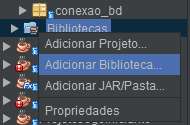
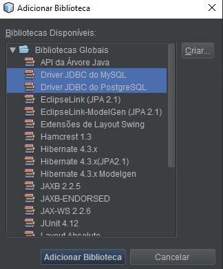

## Introdução

<br>
<br>

Neste texto irei mostrar como fazer uma conexão com banco de dados PostgreSQL e MySQL usando a linguagem de programação JAVA.

#
<br>
<br>
<br>

Vamos usar o Drive JDBC tanto para PostgreSQL quanto para MySQL. Essa biblioteca já vem incluida quando instalamos o NetBeans IDE 8.2, no qual vamos usar para mostrar as demonstrações em código e fazer a conexão com os Banco de Dados.

<br>
<br>

Primeiramente vamos importar o Diver/Biblioteca JDBC para o MySQL e PostgreSQL para que seja possível a conexão com o BD que você eseteja trabalhando. Para fazer isso, basta ir em **bibliotecas** e clicar nele com o botão direito do mouse e vai aparecer **"Adicionar Biblioteca..."** assim como mostra na imagem abaixo:



Em seguida vai aparecer essa lista com os Divers/Bibliotecas disponíveis para adicionar ao seu projeto. Escolha aquela que se encaixe com BD que está a usar. Como vou mostrar a conexão nos dois, então irei adicionar os dois.



<br>
<br>

Em alguns casos, os Drivers JDBC que vem junto com o  NetBeans IDE 8.2 pode não funcionar devido a versão do java ser incompatível com o JDBC ou vice-versa. Para isso, basta você fazer o download dos JDBC do Mysql ou do PostgreSQL, depende de qual você for usar, através desses links:


- [JDBC PostgreSQL](https://jdbc.postgresql.org/download.html)
- [JDBC MySQL](https://dev.mysql.com/downloads/windows/installer/8.0.html)

<br>

Sugiro que veja esse vídeo que mostra um guia de como fazer o download dos JDBC e como colocar eles no seu projeto:


- [Classe genérica JAVA para conexão com BD MySQL e PostgreSQL colocando o JDBC no projeto.](https://youtu.be/v1bFWbiSGP8)


<br>
<br>

Após adicionar o Driver JDBC, vamos criar um pacote para colocar-mos a classe responsável pela conexão com o BD. Eu vou nomear com **"conexao"**, você pode nomear com o nome que queira, porém recomendo colocar um nome que remeta a conexão. O nome da classe que irei usar é o **"connection_DB"**. 


<br>
<br>

Existem diversas formas de você fazer uma conexão com o BD com JAVA e o que irei mostrar é uma das formas de fazer isso. Para fazer a conexão com PostgreSQL e MySql, será preciso nomear alguns atributos finais na classe **"connection_DB"** que guardarão as informações necessárias para a conexão. São elas:

```java

import java.sql.*;

public class conectar {

    // De acordo com qual BD vc esteja trabalhando, temos esses drivers devifindos para o MySql e PostgreSQL.

    private static Connection conexao_MySql = null;
    private static Connection conexao_PostgreSQL = null;


    // local onde o banco de dados está presente. Por padrão, colocarei localhost, mas você
    // pode mudar o local de acordo com sua necessidade.
    private static String localBD = "localhost";

    // Aqui são os LINKS responsáveis pelo local onde o BD estar. é modificável de acordo com suas necessidades
    private static String LINK1 = "jdbc:mysql://"+localBD+":3306/coloque o nome do bd";
    private static String LINK2 = "jdbc:postgresql://localhost:5432/coloque o nome do bd";
    
    // tem essas alternativas do formato do link caso vc queira usar.
    //private static String LINK1 = "jdbc:mysql://localhost:3306/coloque o nome do bd";
    //private static String LINK2 = "jdbc:postgresql://"+localBD+":5432/coloque o nome do bd";
    
    // Nome do usuário e senha com permissão de acesso ao BD. Você coloque de acordo com o
    // usuário e senha pertencente ao Banco de Dados
    private static final String usuario = "";
    private static final String senha = "";


    // Método para fazer a conexão com um banco de dados MySql
    public static Connection connectionMySql(){

        try {

            conexao_MySql = DriverManager.getConnection(LINK1, usuario, senha);
            System.out.println("conexão feita!");


        }
        catch (SQLException e){
            throw new RuntimeException("Ocorreu um problema na conexão no BD.", e);
        }

        return conexao_MySql;
    }

    // Método para fazer a conexão com um banco de dados PostgreSQL.
    public static Connection connectionPostgreSQL(){

        try {
            conexao_PostgreSQL = DriverManager.getConnection(LINK2, usuario, senha);
            System.out.println("conexão feita!");
        }
        catch (SQLException e){
            throw new RuntimeException("Ocorreu um problema no BD", e);
        }
        return conexao_PostgreSQL;
    }


    //O closeConnection serve para o MySql e PostgreSQL. É passado por parâmetro um Objeto do tipo
    // Connection de um BD.
    // con.close() é um método de Connection onde fechamos a conexão da aplicação com o banco de dados.
    public static void closeConnectionMySql(){
        try {
            if (conexao_MySql != null) {
                conexao_MySql.close();
                System.out.println("Deu certo fechar");
            }
        } catch (SQLException e) {
            throw new RuntimeException("Ocorreu um problema para encerrar a conexão com o banco de dados.", e);
        }
    }

    public static void closeConnectionPostgreSQL(){
        try {
            if (conexao_PostgreSQL != null) {
                conexao_PostgreSQL.close();
                System.out.println("Deu certo fechar");
            }
        } catch (SQLException e) {
            throw new RuntimeException("Ocorreu um problema para encerrar a conexão com o banco de dados. ", e);
        }
    }
}
```

<br>
<br>
<br>

Exemplo usando em uma main. 

Nome da classe: principal

``` java

public class principal {
    public static void main(String[] args){
        /*conectar.connectionPostgreSQL();
        conectar.closeConnectionPostgreSQL();*/

        conectar.connectionMySql();
        conectar.closeConnectionMySql();
    }
}


```


Referências:
- https://www.devmedia.com.br/classe-generica-para-conexao-com-postgresql-e-mysql/5492
- https://docs.oracle.com/javase/8/docs/api/java/sql/package-summary.html

Vídeos do texto:
- [Classe genérica JAVA para conexão com BD MySQL e PostgreSQL colocando o JDBC no projeto.](https://youtu.be/v1bFWbiSGP8)
- [Classe genérica JAVA para conexão com BD MySQL e PostgreSQL  apresentando o código da classe](https://youtu.be/c7SblVJtZ-w)
