## Introdução 

 
 

Olá para você que está em busca de configurar o seu discord com bots! Seja bem vindo ao um tutorial de como fazer uma configuração de um bot em um servidor do discord que você administra.

Neste texto você irá encontrar:
 
 

- [Como conectar com sua conta do discord com a Loritta](#como-conectar-com-sua-conta-do-discord-com-a-loritta) 
- [Configurações básicas da Loritta](#configurações-básicas-da-loritta)
  - [Lista de variáveis/placeholders da Loritta](#lista-de-variáveisplaceholders-da-loritta)
  - [Moderação Básica](#moderação-básica)
  - [Eventos salvos em Log](#eventos-salvos-em-log)
  - [Comandos nativos e personalizados](#comandos-nativos-e-personalizados)
  - [Notificações de vídeos de canais no youtube](#notificações-de-vídeos-de-canais-no-youtube)
- [Finalização](#finalização)

 
 

 Lembrando que aqui você não verá, de forma bem detalhada, cada função que a bot Loritta pode entregar para os seus usuário, já que a configuração dela vai de acordo com suas necessidades no servidor do discord no qual você administra. Além disso, a bot Loritta é um bot verificado pelos desenvolvedores do discord, então não precisa ficar preocupado em usar ela.

 
 
 

## Como conectar com sua conta do discord com a Loritta

 

Antes de conectar sua conta do discord com a Loritta, você precisa primeiro criar uma conta discord a partir deste [Link](https://discord.com/). Caso já possua uma conta, não precisa entrar no site do discord e daqui seguir em frente.

Agora, vamos entrar no site oficial do bot Loritta através deste [Link](https://loritta.website/) e você se encontrará com este site (Pode ocorrer mudanças no design do site dependendo da época que esteja lendo este texto).

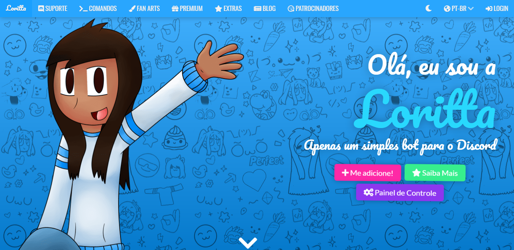

 

Para conectar sua conta do discord com a bot Loritta, clique no canto supeior a direita em **LOGIN**, como mostrado na imagem:

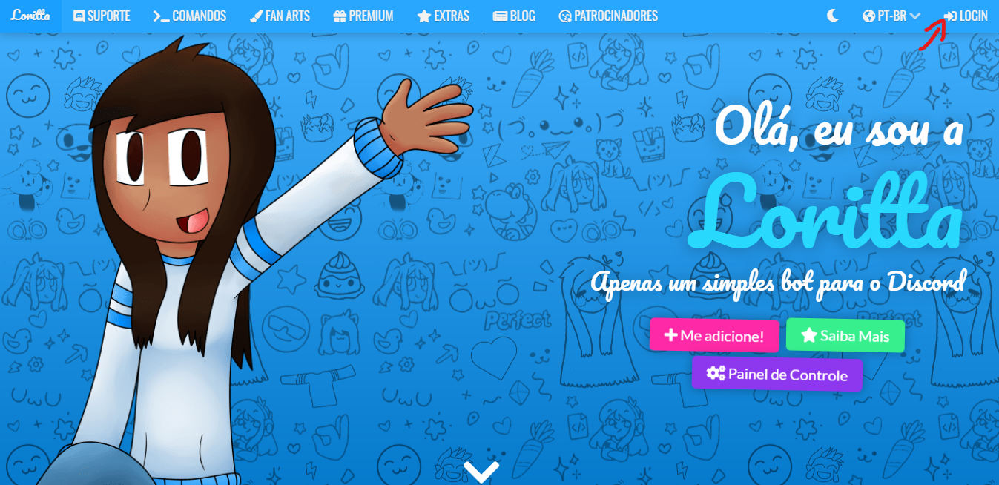

 

Após isso, você vai se deparar com o site do discord pedindo o seu login e senha para acessar sua conta, caso ela não esteja logada. Caso você já esteja com sua conta logada do discord ou após ter efetuado o login, a seguinte mensagem mostrado abaixo será mostrada para você. Vale lembrar que você aceite apenas se concordar com os acessos que a Loritta irá fazer.

 

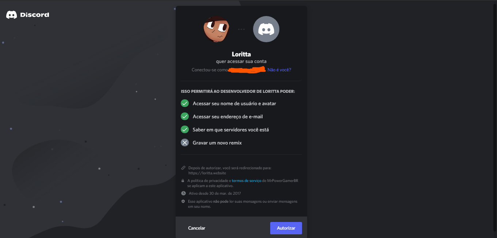

 

Aceitando, você será redirecionado para o dashboard do bot, como mostrado abaixo. Para você adicionar a bot Loritta no servidor desejado, basta clicar em **Configurar Servidor**  que vai aparecer na lista de servidores no qual você é um adminstrador.

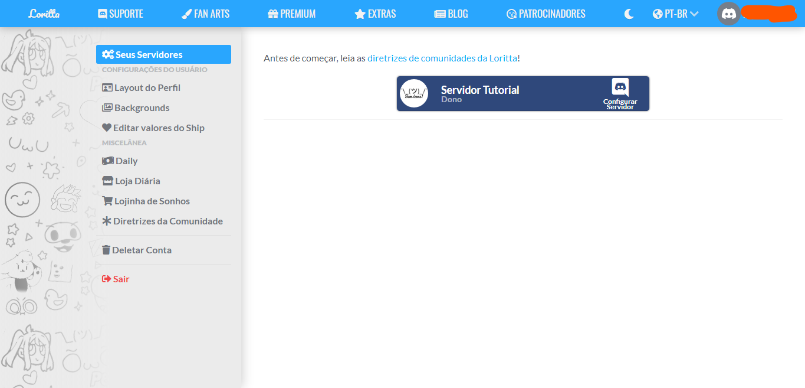

 

Clicando no servidor desejado, você irá ser redirecionado para o seu servidor do discord e será requisitado os acessos adminstrativos dele, como mostrado na imagem abaixo. Deixe marcado apenas aquilo que você queira que o bot utilize, e por via de dúvidas deixe marcado todos.

*Possa ser que seja requerido uma confirmação via email.
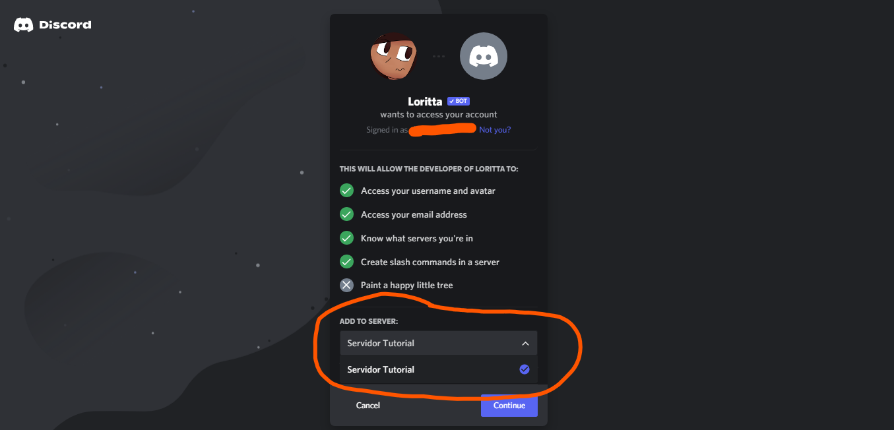

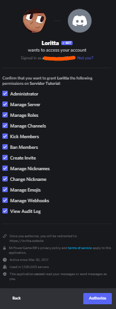

 

Se tudo der certo, você vai se deparar com isso:

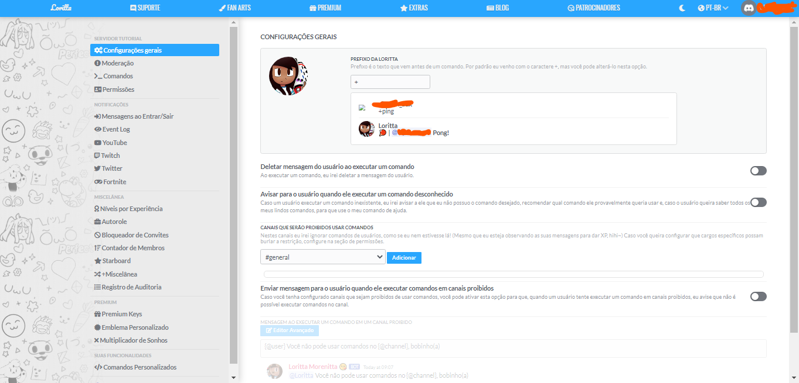

 
 
 

# Configurações básicas da Loritta

Aqui vai depender muito da forma que você quer gerenciar o seu discord. O que eu irei mostrar aqui, é o que eu faço geralmente na configuração dos servidores. 

 
 
 
 
 
 

## Lista de variáveis/placeholders da Loritta

 
 
 

Aqui abaixo segue a lista de variáveis que a Loritta usa:
~~~~
Quais são as variáveis/placeholders que eu posso usar?

{@user}	Menciona o usuário que provocou a ação

{user}	Mostra o nome do usuário que provocou a ação

{user.name}	Mostra o nome do usuário que provocou a ação

{user.discriminator}	Mostra o discriminator do usuário 
que provocou a ação

{user.tag}	Mostra a tag (Nome#Discriminator) do usuário 
que provocou a ação

{user.id}	Mostra o ID do usuário que provocou a ação

{user.avatar}	Mostra a URL do avatar do usuário

{user.nickname}	Mostra o nome do usuário no servidor, caso ele tenha mudado o apelido dele no servidor, irá aparecer o apelido dele, em vez do nome original

{punishment.reason}	Motivo da punição, caso nenhum motivo tenha sido especificado, isto estará vazio

{reason}	Motivo da punição, caso nenhum motivo tenha sido especificado, isto estará vazio

{punishment.type}	Punição aplicada (ban, mute, kick, etc)

{punishment}	Punição aplicada (ban, mute, kick, etc)

{@staff}	Menciona o usuário da equipe que provocou a punição

{staff}	Mostra o nome do usuário da equipe que provocou a punição

{staff.name}	Mostra o nome do usuário da equipe que provocou a punição

{staff.discriminator}	Mostra o discriminator do usuário da equipe que provocou a punição

{staff.tag}	Mostra a tag (Nome#Discriminator) do usuário da equipe que provocou a punição

{staff.id}	Mostra o ID do usuário da equipe que provocou a punição

{staff.avatar}	Mostra a URL do avatar do usuário da equipe que provocou a punição

~~~~

  
  
  

## Moderação básica

Por padrão eu deixo marcado as opções "Enviar punição via mensagem direta?" e "Enviar punição para um canal de punições?". Além disso, você pode aplicar uma sequência de regras em um determinado canal, no meu caso aqui de exemplo, eu só possuo o #general. Aqui podemos escrever mensagens simples como mostrado no exemplo abaixo usando as variáveis mostradas na lista acima

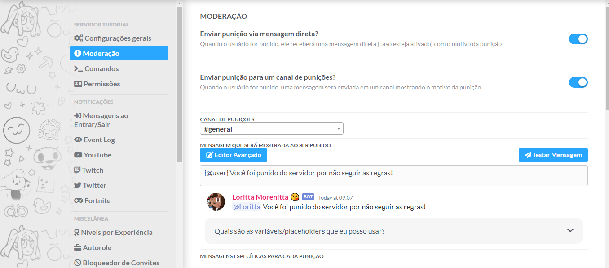

ou podemos fazer uma edição mais avançada clicando em "Editor Avançado" e escrever um código em JSON para configurações mais avançadas. Recomendo apenas para quem entende de JSON.

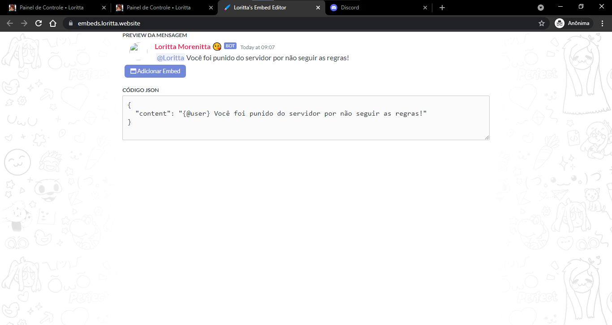

 

Logo abaixo temos os tipos de punições no qual você pode ajustar mensagens para cada tipo situação que se aplica as regras do seu servidor. Abaixo segue quais são elas e, em seguida, alguns exemplos que fiz para mostrar a vocês. 

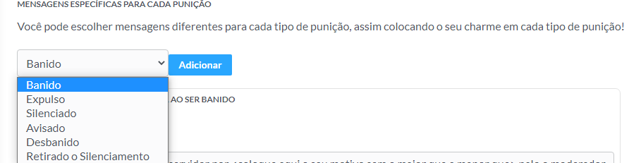

Logo no final da última imagem, podemos ver que temos os avisos onde podemos definir uma quantidade de avisos para que algo ocorra com o usuário. Isso vai depender das regras e da gerência do seu servidor.

 
 
 
 

## Eventos salvos em Log

 
 
 

No **Event Log** na lista lateral a esqueda onde podemos ativar e logs que guardam em um canal de texto, de preferência privado para os adminstradores e moderadores usarem, informações das coisas que acontecem no discord. Por exemplo, na imagem abaixo mostra um log onde registra todas as mudanças de nick/apelidos usado no discord. Você pode configurar essa parte de acordo com as preferências que o servidor possui.

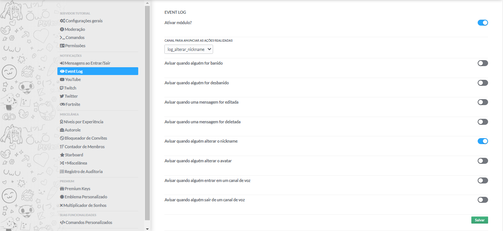

 
 

## Comandos nativos e personalizados

Temos a parte dos comandos e comandos personalizados, onde podemos criar algumas comandos onde os usuários podem usar para terem uma interação maior com as pessoas do servidor. Como é uma lista enorme de comandos nativos da Loritta, eu não preferi colocar eles. Porém você pode ver indo em **Comandos** na parte SERVIDOR TUTORIAL. No caso dos comandos personalizados, podemos fazer nossos próprios comandos que podem fazer diversas coisas. Segue um exemplo abaixo:

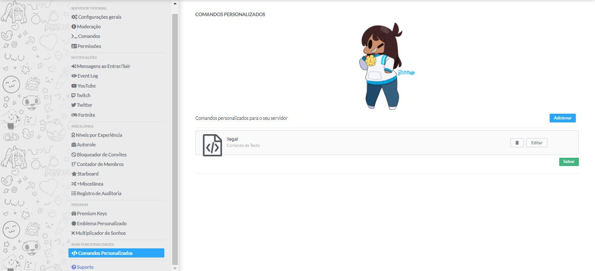
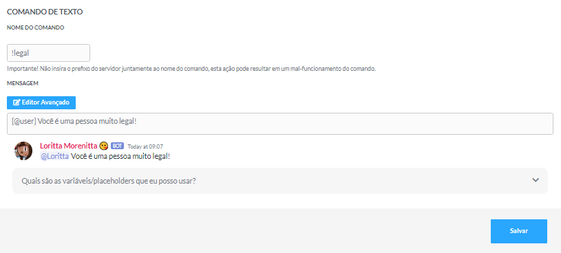

 
 

## Notificações de vídeos de canais no youtube

Para finalizar, temos a parte de notificações. Eu já mostrei o **Event Log**, mas agora vou mostrar os outros. Como exemplo, temos a parte do youtube, onde podemos configurar a Loritta para avisar em um determinado canal todos os vídeos que saem em um determinado canal, ou a twitch que avisa quando determinado canal entrou em livestream. A imagem abaixo mostra como funciona as notificações para o youtube:

 
 

Você colocar o link que redireciona para o canal do youtube, configura uma mensagem para a Loritta mostrar para todos que podem ver o canal de chat que foi marcado para ela enviar as notificações e pronto, é só esperar pelos os novos vídeos do canal! Aqui, também, podemos usar JSON para aplicar funcionalidades mais avançadas como vocês podem ver:

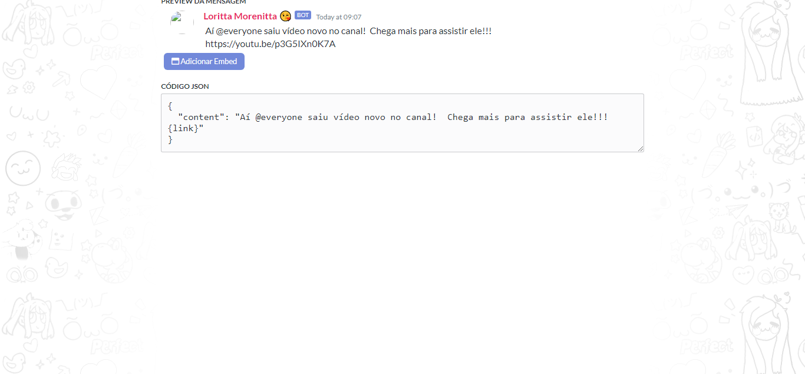

 
 
 
 

## Finalização

 
 

Isso encerra o tutorial básico de configurações iniciais que podemos fazer com a bot Loritta! Existem diversas funcionalidades incríveis que podemos fazer com ela, mas aqui é mais uma iniciação ao uso dela. Também temos a versão premium dela, onde traz mais funcionalidades no qual pode melhorar muito o seu servidor do discord de acordo com as ideias que os moderadores e administradores usam como regras, eventos, brincadeiras, entre outros.