

<h1>Introdução</h1> 

 

Neste guia iremos mostrar uma breve visão e funcionalidades básicas da ferramenta pgAgmin4 para administrar o PostgreSQL, onde vamos mostrar onde podemos baixar e instalar e o uso de suas ferramentas que auxiliam na administração do banco de dados.

 
 

## Instalação

 

A instalação do PostgreSQL, tanto no windows quanto no linux, é bem simples. Irei mostrar como é feito a instalação nos dois Sistemas Operacionais.

 
 
### 1. Linux
Primeiramente, precisamos entrar no site oficial do PosgreSQL através deste link ( [https://www.postgresql.org/download/](https://www.postgresql.org/download/ ) ), onde iremos fazer o download do PostgreSQL. Após entrar, vocẽ verá o site mais ou menos assim:

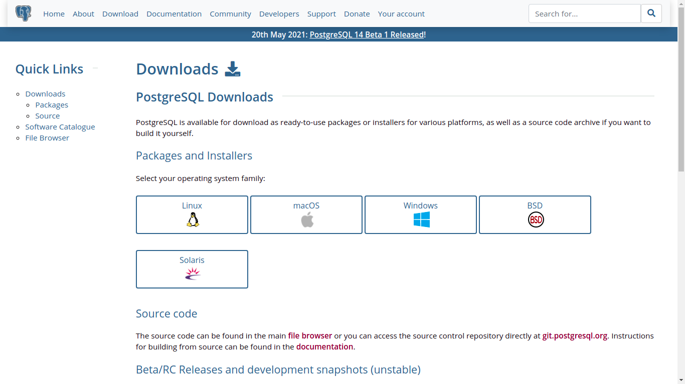

Agora vamos clicar no ícone do linux e vai aparecer diversas distros, onde você irá escolhar qual delas é a que você usa. Após selecinar qual distro você usa, basta seguir todos os passos descritos no site para fazer a instalação do postgreSQL. Vale ressaltar que o pgAdmin é instalado juntamente com o postgreSQL. Caso não queira fazer a instalação via terminal, tem a opção e baixar a versão para o linux através deste link [https://www.enterprisedb.com/downloads/postgres-postgresql-downloads](https://www.enterprisedb.com/downloads/postgres-postgresql-downloads).
    
 
 

### 2. Windows
No Windows é mais diferente, para baixar o postgreSQL, precisamos entrar neste site ( [https://www.enterprisedb.com/downloads/postgres-postgresql-downloads](https://www.enterprisedb.com/downloads/postgres-postgresql-downloads)). Este link é encontrado no site oficial do postgresql, na parte onde você seleciona o windows como o seu sistema operacional (você pode ver a imagem na parte de instalação do linux).

 

Quando você entrar neste link, você irá se depará com esse site: 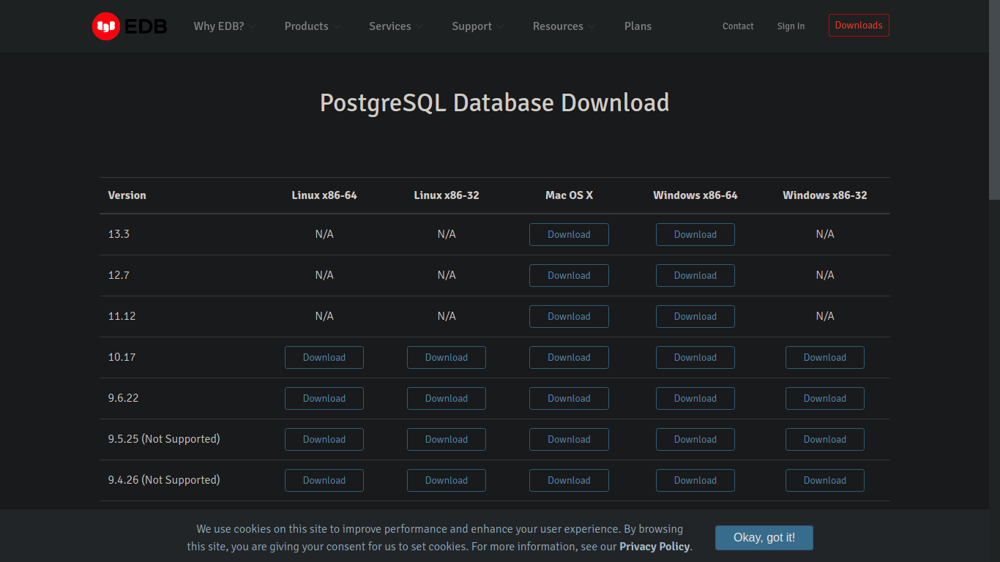

Aqui você escolher qual versão do windows você usa e instalar ele normalmente executando o arquivo baixado.

 
 

O vídeo neste link [text](https://link) explica de forma detalhada de como instalar o postgreSQL e também mostra na prática as funcionalidades do pgAdmin4.

 #
Agora vamos ver algumas funcionalidades que podemos fazer no pgadmin4.  

 
 
 

## Criando um banco de dados no pgAdmin

 

Após feita a instalação, podemos começar a trabalhar com bancos de dados postgreSQL. Primeiro, vamos criar um banco de dados. Exista algumas formas de criar um BD, uma delas seria você clicar com o botão direito em **databases**, ir em **Create** e, por último, em **Database...**. A imagem abaixo ilustra isso.
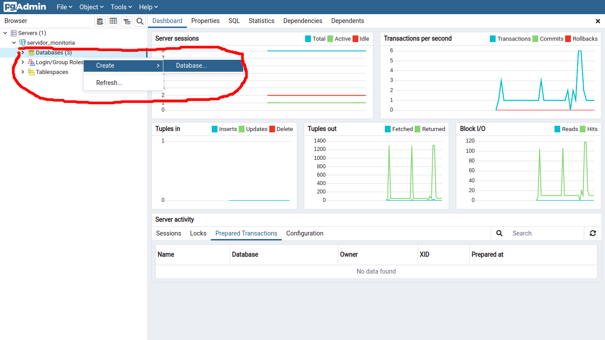

 

Clicando em **Database...**, vai aparecer uma página parecida como essa:
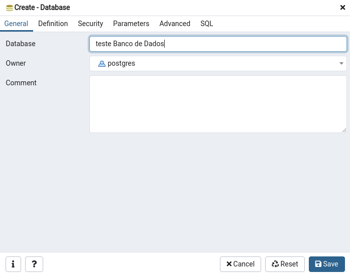

 

A princípio, vamos deixar tudo no padrão e apenas colocaremos o nome do banco de dados que você quer criar. Você pode escolher qualquer nome para ele. Após isso, vamos clicar em **Save** e pronto, o seu banco de dados está criado.

 
 
 

## Criando um script 

 

Para criar um script é simples, basta você clicar no botão direito do mouse no banco de dados que você vai usar e selecionar a opção **CREATE Script**, como pode ser visto na imagem abaixo:

 
 

Se tudo der certo, vai aparecer algo parecido com isso,
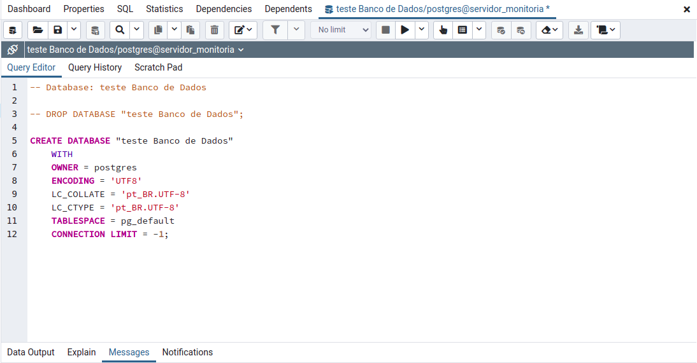

Aqui será onde você vai criar suas tabelas, fazer consultas, inserir dados, entre outros, usando SQL.

 
 

## Criando tabelas sem escrever códigos em SQL

 

Aqui, **não recomendo usar para quem é iniciante em SQL**, pois será criado tabelas usando interface gráfica e isso atrapalharia o seu aprendizado em criar tabelas com scripts em SQL, algo extremamente importante para quem quer aprender banco de dados. Essa opção pode servir para aqueles que já tem um conhecimento e praticidade em SQL e quer, talvez, ganhar tempo na hora de criar tabelas em SQL.

 

Primeiro, vamos em **Schemas** do banco de dados que você está trabalhando, 

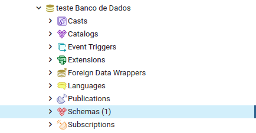

procure por **Tables** e clique no botão direito nele e, em seguida, vá em **Create** e clique em **Table...** . 

Fazendo isso vai aparecer a seguinte janela:

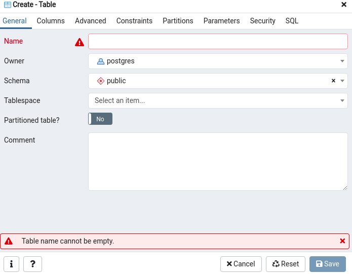

  

Primeiro coloque o nome da tabela que você vai criar. Eu, no caso, chamarei de pessoa. Agora para nomear quais colunas essa tabela terá, vamos em **Columns** e vamos colocar todas as colunas que queremos. Para criar uma nova coluna, basta clicar no "+" no canto superior direito e depois é só colocar os nomes dos cas colunas. A imagem abaixo mostra o exemplo de como eu criei colunas para a tabela pessoa. 

Após isso, clique em salvar e, pronto! Foi criada uma tabela no seu banco de dados

 
 

## Salvando um script SQL no computador

 
 

Para salvar um SCRIPT SQL feito no pgAdmin4 é simples. Por exemplo, veja esse script que criei para construir duas tabelas em um banco de dados: 

 
 

Para salvar o script, clique no ícone de disquete marcado na imagem abaixo:

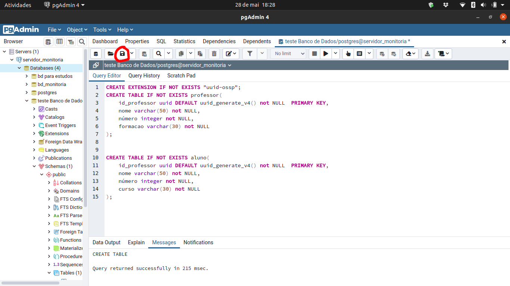

 
 

Com isso vai aparecer essa janela mostrando onde você quer salvar o arquivo. Quando você chegar na pasta onde você quer salvar o script, na caixa que mostra o diretória da pasta e em seguida escreva o nome do script que será salvo, como por exemplo "scriptbd.sql". Por fim, basta clicar em save e pronto, o script foi salvo.

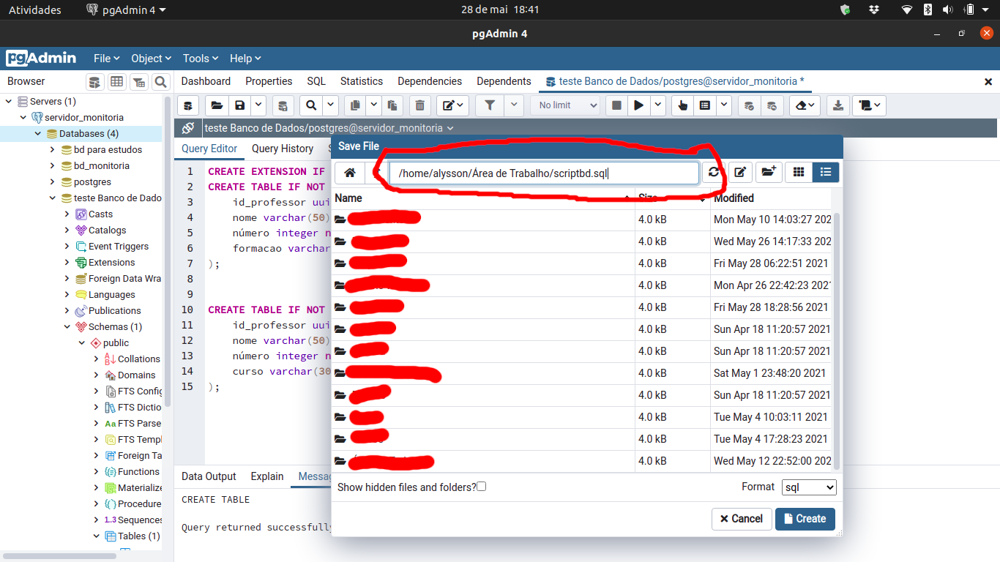

 
 

## Criando um modelo entidade relacionamento

 
 

Para concluir o guia, vou mostrar como criar um modelo entidade relacionamento de um banco de dados. Vale ressaltar que essa ferramenta do pgAdmin4 está em beta, então pode ocorrer erros. Clique, com o botão direito do mouse, no banco de dados que queira criar um MER(modelo entidade relacionamento) e clique em Generate ERD (Beta) e automaticamente será criado um MER. Imagem abaixo mostrando onde fica:

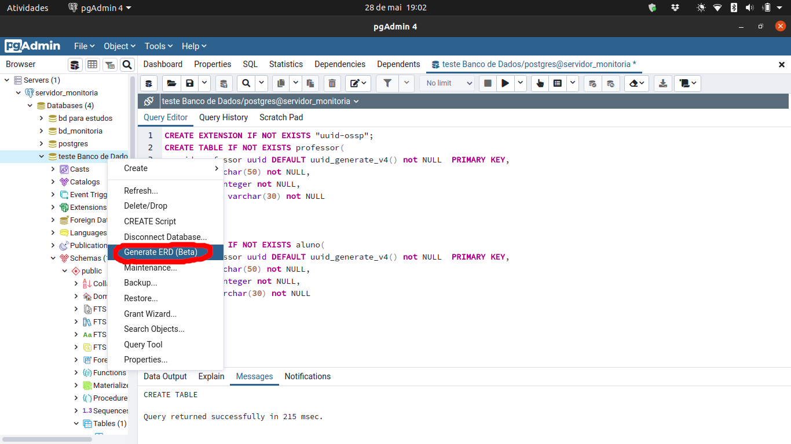

 
 

MER:

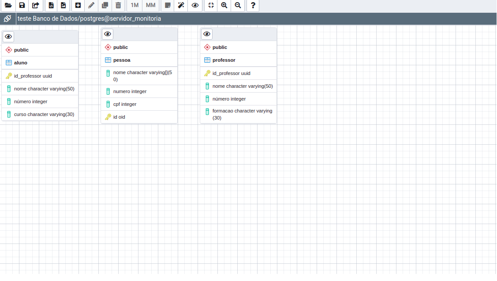