# _Entendendo e personalizando gráficos de distribuição/dispersão._

No final do tutorial passado, vimos resumidamente tipos de gráficos de distribuição sendo eles: gráfico de barras, diagrama de caixa e gráfico de dispersão. Se você não viu esse tutorial, [clique aqui](https://github.com/ciencia-de-dados-pratica/GEAM-basico/blob/master/2021/Paula%20-%20Introdu%C3%A7%C3%A3o%20ao%20Matplotlib%20e%20personalizando%20gr%C3%A1ficos%20simples/tutorial%20-%20Introdu%C3%A7%C3%A3o%20ao%20Matplotlib%2C%20personalizando%20gr%C3%A1ficos%20simples.md). Agora, vamos aprofundar o nosso conhecimento sobre esses gráficos.

Vamos aplicar esses gráficos sobre os dados de [cesta de compras](https://www.kaggle.com/mittalvasu95/the-bread-basket/tasks?taskId=2228), do kaggle. Vamos conhecê-lo no próximo tópico.

## Conhecendo o dataset

### Visualizar dados

```
df = pd.read_csv('basket_analysis.csv')
df
```
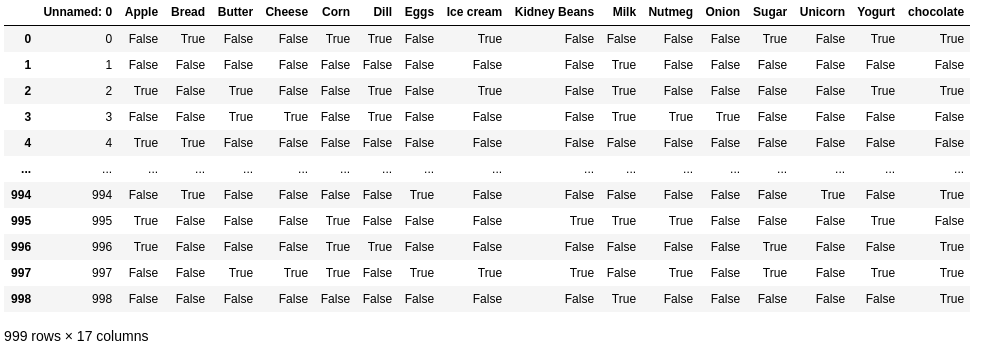

Como mostra a imagem, temos 999 dados e 17 colunas. Vamos trabalhar apenas com 16 colunas, já que a coluna de índice 0, só guarda índices.

```
colunas = df.columns[1:]
df2 = df[colunas]
df2
```


Para poder trabalhar com os gráficos, precisamos saber quantas vezes cada produto acontece dentro do dataset. Para fazer isso, vamos separar essas informações em arrays e a partir disso criar um novo dataframe.
```
colunas = (df2.columns).tolist()
colunas
```
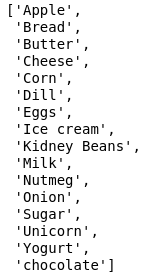

```
quantidade = (df2.sum()).tolist()
quantidade
```
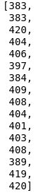

Vamos criar um dicionário para passar para o dataframe.
```
dicionario = {'produto': colunas, 'quantidade': valores}
dicionario
```
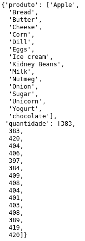

```
dfProdutos = pd.DataFrame(data=dicionario)
dfProdutos
```
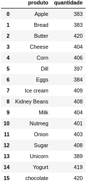

Agora nossos dados estão prontos para trabalhar para podermos aplicá-los nos gráficos.


## 1. Gráfico de barras

Usamos gráfico de barras quando desejamos realizar comparações. Por exemplo, no canal Ciência de Dados Prática, existem vários tipos de vídeos, poderíamos criar categorias para esse tipos de vídeos e através disso, manipular os dados de interações( quantidade de visualizações, quantidade de curtidas e quantidade de comentários) e aplicá-los em um gráfico de barras. Dessa forma, poderíamos visualizar quais categorias de vídeos mais conseguem atingir o público. 
No entanto, os dados que vamos tratar são os da análise de cesta de compras

### 1.1. Conhecendo parâmetros

``` 
pyplot.bar(x, height, width=0.8, bottom=None, align='center')
```
**Parâmetros usados comumente:**
* x: As coordenadas x das barras.
* height: As alturas da barras.
* width: largura das barras, valor padrão: 0,8
* bottom: As coordenadas y das bases da barra.
* align: Alinhamento da barras às coordenadas x {'center', 'edge'}, padrão: 'center'

<br>

**Outros parâmetros**
* cor: A cor ou lista de cores das barras.
* edgecolor: A cor ou lista de cores das bordas da barra .
* linewidth: Largura da borda das barras. 
* tick_label: Os rótulos das barras.
* xerr, yerr: Criação de barras de erro.
* ecolor: A cor ou lista de cores da linha das barras de erro.
* capsize: O comprimento dos limites da barra de erro em pontos.
* error_kw: Dicionário de kwargs a ser passado para o método. 
* log: Se for Verdadeiro , defina o eixo y como escala logarítmica.
* kwargs: propriedade usada, padrão: Rectangle

### 1.2. Mãos na massa
 ```
x = np.arange(len(dfProdutos.produto))
    plt.subplots(figsize=(20,5))
plt.bar(x, dfProdutos.quantidade, tick_label = dfProdutos.produto)
```


Para usar o gráfico de barras horizontal basta usar barh.
```
plt.subplots(figsize=(10,7))
plt.barh(x, dfProdutos.quantidade, tick_label = dfProdutos.produto, color = "#234159")
```
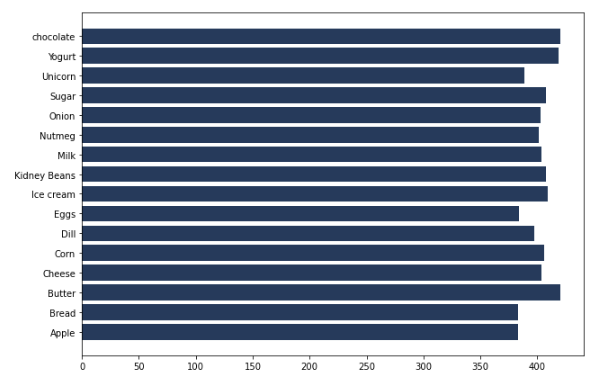

A seguir, um exemplo para visualização de categorias, que é apresentado pelo site da biblioteca Matplotlib. Se você leu o tutorial anterior, vai entender os parâmetros usados e que essa plotagem usa orientação à objeto.
``` 
labels = ['G1', 'G2', 'G3', 'G4', 'G5']
men_means = [20, 34, 30, 35, 27]
women_means = [25, 32, 34, 20, 25]

x = np.arange(len(labels))  # the label locations
width = 0.35  # the width of the bars

fig, ax = plt.subplots()
rects1 = ax.bar(x - width/2, men_means, width, label='Men')
rects2 = ax.bar(x + width/2, women_means, width, label='Women')

# Add some text for labels, title and custom x-axis tick labels, etc.
ax.set_ylabel('Scores')
ax.set_title('Scores by group and gender')
ax.set_xticks(x)
ax.set_xticklabels(labels)
ax.legend()

fig.tight_layout()

plt.show()
``` 
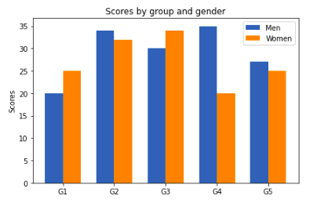

## 2. Gráfico de dispersão
Representam dados de duas ou mais variáveis que são organizadas usando coordenadas cartesianas para exibir os valores. Exemplo de aplicação: o diretor de uma empresa de varejo identificou que nos últimos meses houve um aumento significativo do faturamento e um aumento no número de clientes. Ele então, fez um gráfico de dispersão para identificar se o aumento do faturamento tinha relação com o aumento do número de clientes.

### 2.1. Conhecendo parâmetros

* x, y: As posições de dados.
* s: O tamanho do marcador em pontos ** 2. O padrão é .rcParams['lines.markersize'] ** 2
* c: As cores do marcador.
* marker: O estilo do marcador. Marcador pode ser uma instância da classe ou a abreviação de texto para um marcador específico. Consulte Recursos `matplotlib.markers` para obter mais informações sobre estilos de marcador.
* cmap: Nome de mapa de cores registrado. cmap só é usado se c for um array de floats.
* norm: é usado para dimensionar os dados de cor, c , no intervalo de 0 a 1, a fim de mapear no cmap do mapa de cores . Se nenhum, use o padrão `colors.Normalize`.
* vmin, vmax: são usados ​​em conjunto com a norma padrão para mapear a matriz de cores c para o mapa de cores cmap.
* alpha: O valor de mistura alfa, entre 0 (transparente) e 1 (opaco).
* linewidths: A largura de linha das bordas do marcador. Nota: As cores de bordas padrão é 'face'. 
* edgecolors: A cor da borda do marcador. 
* plotnonfinite: informa se os pontos serão plotados com as cores definidas ou não.

### 2.2. Mãos na massa
```
mes = ['janeiro', 'fevereiro', 'março','abril', 'maio', 'junho', 'julho', 'agosto', 'setembro', 'outubro', 'novembro', 'dezembro']
faturamento = [2000, 3000, 4000, 5000, 3000, 5000, 5000, 5000, 6000, 8000, 10000, 15000]
quantidadeClientesNovos = [15, 13, 21, 16, 10, 24, 17, 15, 23, 27, 34, 48]
plt.scatter(quantidadeClientesNovos, faturamento)
```


Exemplo de aplicação apresentada pelo site da biblioteca.
```
np.random.seed(19680801)


x = np.arange(0.0, 50.0, 2.0)
y = x ** 1.3 + np.random.rand(*x.shape) * 30.0
s = np.random.rand(*x.shape) * 800 + 500

plt.scatter(x, y, s, c="g", alpha=0.5, marker=r'$\clubsuit$',
            label="Luck")
plt.xlabel("Leprechauns")
plt.ylabel("Gold")
plt.legend(loc='upper left')
plt.show()
```
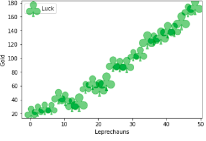

## 3. Diagrama de caixa
[O boxplot (diagrama de caixa) é um gráfico utilizado para avaliar a distribuição empírica do dados. O boxplot é formado pelo primeiro e terceiro quartil e pela mediana. As hastes inferiores e superiores se estendem, respectivamente, do quartil inferior até o menor valor não inferior ao limite inferior e do quartil superior até o maior valor não superior ao limite superior. Os limites são calculados da forma abaixo.](http://www.portalaction.com.br/estatistica-basica/31-boxplot)

Limite inferior: max{min(dados);Q1−1,5(Q3−Q1)}.

Limite superior: min{max(dados);Q3+1,5(Q3−Q1)}.

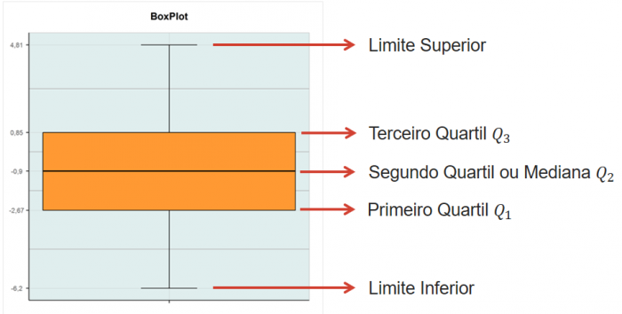

### 3.1. Conhecendo parâmetros
* x: Os dados de entrada.
* notch: Se deve desenhar um gráfico de caixa entalhado (True) ou um gráfico de caixa retangular ( False). Os entalhes representam o intervalo de confiança (IC) em torno da mediana. 
* sym: O símbolo padrão para pontos de aviador. Uma string vazia ('') esconde os folhetos. Se None, então o padrão dos panfletos é 'b +'. Mais controle é fornecido pelo parâmetro flierprops 
* vert: Se True, desenha caixas verticais. Se False, desenhe caixas horizontais.
* whis: A posição dos bigodes.
* bootstrap: Especifica se deve inicializar os intervalos de confiança em torno da mediana para boxplot entalhado.
* usermedians: Um 1D de comprimento semelhante a uma matriz len(x). Cada entrada que não é None força o valor da mediana para o conjunto de dados correspondente. Para entradas assim None, as medianas são calculadas pelo Matplotlib normalmente.
* conf_intervals: Uma forma de matriz 2D.
* positions: As posições das caixas. Os ticks e limites são definidos automaticamente para coincidir com as posições. O padrão é onde N é o número de caixas a serem desenhadas. range(1, N+1)
* widths: As larguras das caixas. O padrão é 0,5.
* patch_artist: Se False produz caixas com o artista Line2D. Caso contrário, caixas e desenhadas com artistas Patch.
* labels: Rótulos para cada conjunto de dados (um por conjunto de dados).
* manage_ticks: Se for True, os locais e rótulos dos tique serão ajustados para corresponder às posições do boxplot .
* autorange: Quando True, os dados são distribuídos de forma que os percentis 25 e 75 sejam iguais.
* meanline: Se True, tentará renderizar a média como uma linha que abrange toda a largura da caixa de acordo com a média. Não recomendado se showotches também for True. Caso contrário, as médias serão mostradas como pontos.
* zorder: O zorder do boxplot 

### 3.2. Mãos na massa
Vamos voltar a aplicar o gráfico para o nosso dataset inicial.
```
plt.boxplot(dfProdutos.quantidade);  
```
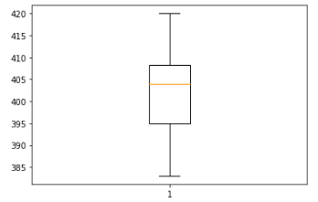

Agora vamos ver um exemplo do site da biblioteca, em que aplica cores no boxplot.
```
np.random.seed(19680801)
all_data = [np.random.normal(0, std, size=100) for std in range(1, 4)]
labels = ['x1', 'x2', 'x3']

fig, (ax1, ax2) = plt.subplots(nrows=1, ncols=2, figsize=(9, 4))

# rectangular box plot
bplot1 = ax1.boxplot(all_data,
                     vert=True,  # vertical box alignment
                     patch_artist=True,  # fill with color
                     labels=labels)  # will be used to label x-ticks
ax1.set_title('Rectangular box plot')

# notch shape box plot
bplot2 = ax2.boxplot(all_data,
                     notch=True,  # notch shape
                     vert=True,  # vertical box alignment
                     patch_artist=True,  # fill with color
                     labels=labels)  # will be used to label x-ticks
ax2.set_title('Notched box plot')

# fill with colors
colors = ['pink', 'lightblue', 'lightgreen']
for bplot in (bplot1, bplot2):
    for patch, color in zip(bplot['boxes'], colors):
        patch.set_facecolor(color)

# adding horizontal grid lines
for ax in [ax1, ax2]:
    ax.yaxis.grid(True)
    ax.set_xlabel('Three separate samples')
    ax.set_ylabel('Observed values')

plt.show()
```
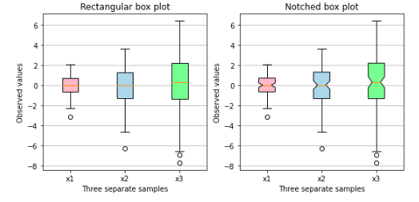


## Referências
[Diagrama de dispersão.](https://ferramentasdaqualidade.org/diagrama-de-dispersao/#:~:text=Exemplos%3A,n%C3%BAmero%20de%20clientes%20(causa))

[Parâmetros, gráfico de dispersão.](https://matplotlib.org/stable/api/_as_gen/matplotlib.pyplot.scatter.html?highlight=scatter#matplotlib.pyplot.scatter)

[Parâmetros, boxplot](https://matplotlib.org/stable/api/_as_gen/matplotlib.pyplot.boxplot.html?highlight=boxplot#matplotlib.pyplot.boxplot)

[Exemplo, boxplot](https://matplotlib.org/stable/gallery/statistics/boxplot_color.html#sphx-glr-gallery-statistics-boxplot-color-py)


#### Para acessar o material em vídeo:
[Entendendo e personalizando gráficos de barras e de dispersão](https://www.youtube.com/watch?v=68ohXG_1nT0) <br>
[Entendendo e personalizando gráficos de caixa](https://www.youtube.com/watch?v=5WJGXKbeqb4)
