# *Sintaxe python para quem está migrando de linguagem de programação.*
Esse tutorial é destinado à programadores que querem conhecer a sintaxe da linguagem python.

## Sumário
1. A linguagem mais usada entre os cientistas de dados brasileiros.
2. Conhecendo a sintaxe do python. 
    2.1. Variáveis. 
    2.2. Tipos. 
    2.3. Entrada e saída. 
    2.4. Condicional. 
    2.5. Repetição. 
    2.6. Funções. 
    <ol>
    2.6.1. Usando <b>def</b>. 
    2.6.2. Usando <b>lambda</b>. 
    </ol>
    2.7. Listas. 
    <ol>
    2.7.1. Manipulações de listas. 
    2.7.2. Conheça a <b>range</b>. 
    </ol>
3. Referências 

## 1. A linguagem mais usada entre os cientistas de dados brasileiros.
Python é a linguagem mais usada na área de Ciência de Dados no Brasil, segundo a [TecMundo](https://www.tecmundo.com.br/software/208403-4-linguagens-crescimento-mercado-data-science.htm?fbclid=IwAR0_1w7KsQIHnOxG6FokZ2vPeQ-76Bg1BTAimZ5t5SSYqtlzWX6fI_EGUyw). Isso se deve ao seu alto poder computacional, seu grande número de bibliotecas disponíveis, sua legibilidade e sua fácil depuração. [É uma linguagem de programação de alto nível, interpretada de script, imperativa, orientada a objetos, funcional, de tipagem dinâmica e forte](https://pt.wikipedia.org/wiki/Python)

## 2. Conhecendo a sintaxe do python.

### 2.1. Variavéis
Diferente de muitas linguagens de programação em que precisamos definir o tipo da variável, a linguagem python não precisa disso. Sua tipagem é definida quando passamos um dado para aquela variável. Por exemplo, `x = 10`, nesse momento a variável possui o tipo **int**, mas se a na linha seguinte colocássemos `x = "Ciência de Dados Prática"`, o tipo se tornaria **str**.

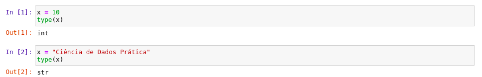

### 2.2. Tipos.
Em python, existem os seguintes tipo: inteiro (int), ponto flutuante (float), booleano (bool), complexo (complex) e string(str). Mais na frente veremos formas de maniuplar esses tipos.

### 2.3. Entrada e saída.
**Entrada**: Para pedir um dado, basta declarar uma variável e passar a função input, `x = input("Qual o valor de x")`. Mas é válido saber, que essa função retorna uma string, então poderíamos converter o valor dela da seguinte forma, `x = int(input("Qual o valor de x"))`. O texto que está dentro do input é o que queremos que apareça para o usuário ao solicitar um dado. 
**Saída**: Na saída, basta declaramos a função print e passar o que queremos que ela mostre, `print("O valor de x é", x)`. Repare que na função, o texto que adicionamos para mostrar do usuário é separado da variável e isso acontece para todos os casos. 
**Usando entrada e saída**:

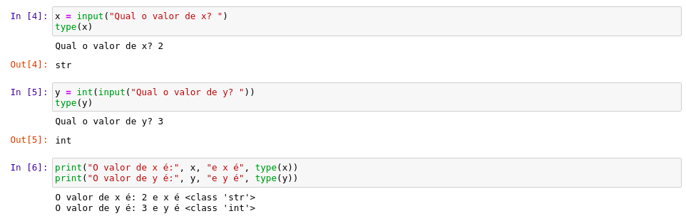

### 2.4. Condicional.
O condicional em python, não é muito diferente de outras linguagens, no entanto, ainda assim, o uso da sintaxe é super importante para evitar erros. 
**Diferenças**: Precisamos usar ":" no final de toda condição, ao invés de usar **else if**, usamos **elif**, veja a seguir:

Observe a indentação, ela precisa estar correta para evitar erros durante a compilação do seu código.
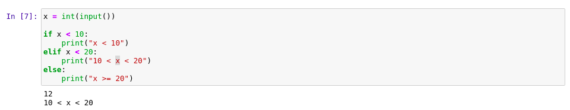

## 2.5. Repetição
Aqui veremos o **while** e o **for**, você poderá observar que assim como no condicional, ao invés de usar algo como chaves, usamos o ":".

**Uso do while:** Repare que o while não muda tanto.
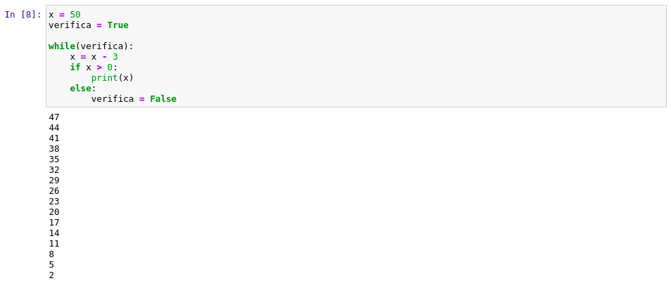

**Uso do for:** O for assume o formato do que chamamos de foreach. O **i** vai percorer o que estamos passando após o **in**.
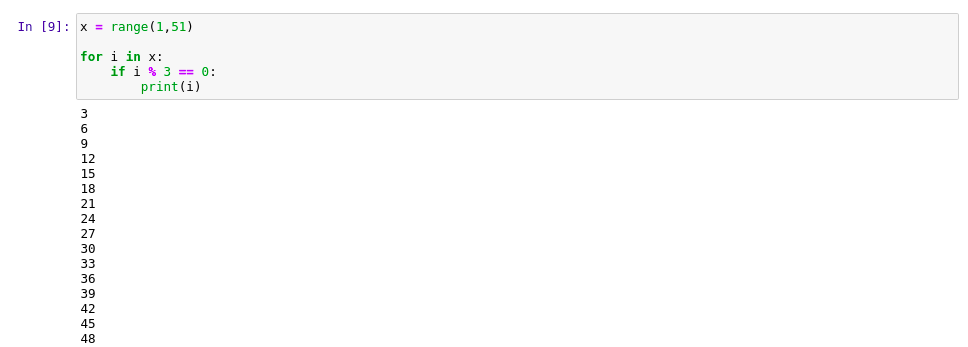

## 2.6. Funções
Assim como nas variáveis, nós precisamos dizer qual o tipo do retorno de uma função.

### 2.6.1. Usando def
O def serve para definir a nossa função, informar que estamos criando uma função. Observe a seguir, o cálculo do fatorial.

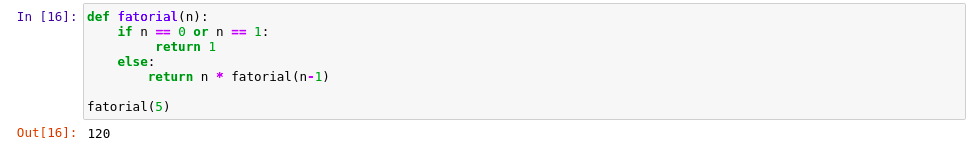

### 2.6.2. Usando lambda
Usar lambda para criar uma função, significa que estamos usando uma função anônima, uma função sem nome, veja a seguir, os exemplos a seguir:

Repare que, quando declaramos `lambda x:`, isso significa que essa função vai esperar receber apenas um parâmetro, após o `:`, descrevemos o comportamento da função. Ela devolve `Par` se x passar pela primeira condição. Repare também que não estamos usando `:` após a condição do if e do else, isso de deve a como temos que declarar a função lambda, primeiro passando seu primeiro retorno.

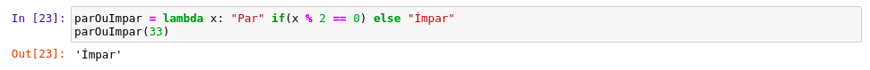

Agora veja o nosso mesmo fatorial sendo definido como uma função lambda.

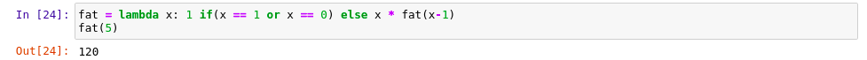

## 2.7. Listas
Em python, os nossos vetores são os arrays, as listas são outros tipo definição. [As diferenças entre lista e array em Python são na performance e nas funcionalidades disponíveis. O array usa menos memória do que a lista, é mais rápido nas operações de leitura e possibilita executar operações matemáticas sobre todos os itens de uma só vez. Além disso, no array todos os elementos têm que ter o mesmo tipo de dado, mas a lista pode ter elementos de tipos diferentes.](https://vaiprogramar.com/diferenca-lista-array-python/#:~:text=As%20diferen%C3%A7as%20entre%20lista%20e,itens%20de%20uma%20s%C3%B3%20vez.)

### 2.7.1 Manipulações de listas

**Tipo** 
Repare que uma lista não possui um tipo específico, podendo ter mais de um tipo de dados 
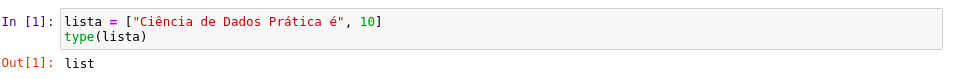

**Concatenação** 
Podemos concatenar com listas de dados diferentes também.
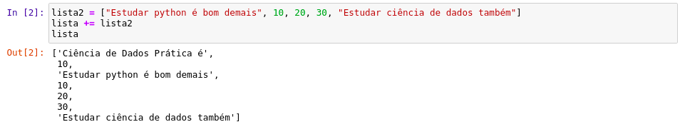

**Mudar elemento da lista** 
Podemos mudar o elemento apenas acessando seu índice na lista.
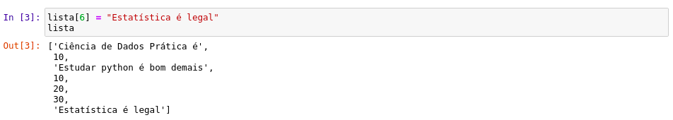

**Deleção de elemento** 
Agora, vamos deletar os elementos que são do tipo `str`. Veja que deletamos de um por um, devido que a cada deleção os índices são atualizados automaticamente.
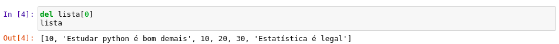
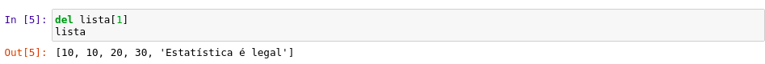
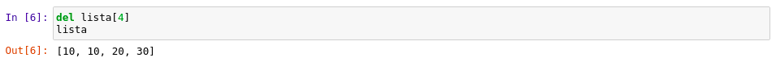

**Ordenando lista** 
Vamos adicionar mais elementos na nossa lista.
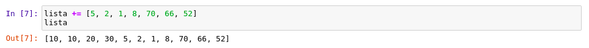

Agora com mais elementos e apenas elementos númericos, podemos ordenar essa lista da seguinte maneira:
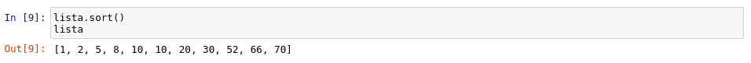

### 2.7.2. Conheça a range
[A função range() retorna uma série numérica no intervalo enviado como argumento. A série retornada é um objeto iterável tipo range e os elementos contidos serão gerados sob demanda.](http://excript.com/python/funcao-range-python.html#:~:text=A%20fun%C3%A7%C3%A3o%20range()%20permite,o%20%C3%BAltimo%20elemento%20da%20sequ%C3%AAncia.&text=Na%20defini%C3%A7%C3%A3o%20da%20fun%C3%A7%C3%A3o%20range,sequ%C3%AAncia%20%C3%A9%20aberto%20ou%20fechado.) Usando a função `range`, só somos obrigados a informar quando a range terminar, por exemeplo `range(5)`, isso irá nos retornar os 5 primeiros elementos a partir de 5, mas também podemos informar de onde a range começa e onde ela termina, `range(5, 11)`, usando esse código nossa função retorna uma range que começa em 5 e termina em 10(sempre um a menos do que o que foi passado na função). Podemos também fazer com que essa range pule os números de 2 em 2, ou qualquer quantidade que a gente queira, usando `range(5, 11, 2)`, esse último elemento é o que indica de quanto em quantos números vamos pular.

**Por que estamos vendo range em um tópico de lista?**
Porque podemos transformar uma range em uma lista, da seguinte maneira: 
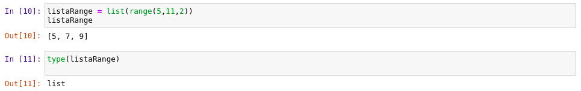

## 3. Referências
[Linguagem mais usada entre os cientistas de dados no Brasil - TecMundo](https://www.tecmundo.com.br/software/208403-4-linguagens-crescimento-mercado-data-science.htm?fbclid=IwAR0_1w7KsQIHnOxG6FokZ2vPeQ-76Bg1BTAimZ5t5SSYqtlzWX6fI_EGUyw)

[Definição da linguagem python](https://pt.wikipedia.org/wiki/Python)

[Diferença entre array e lista em python](https://vaiprogramar.com/diferenca-lista-array-python/#:~:text=As%20diferen%C3%A7as%20entre%20lista%20e,itens%20de%20uma%20s%C3%B3%20vez.)

[Definição da range](http://excript.com/python/funcao-range-python.html#:~:text=A%20fun%C3%A7%C3%A3o%20range()%20permite,o%20%C3%BAltimo%20elemento%20da%20sequ%C3%AAncia.&text=Na%20defini%C3%A7%C3%A3o%20da%20fun%C3%A7%C3%A3o%20range,sequ%C3%AAncia%20%C3%A9%20aberto%20ou%20fechado.)
