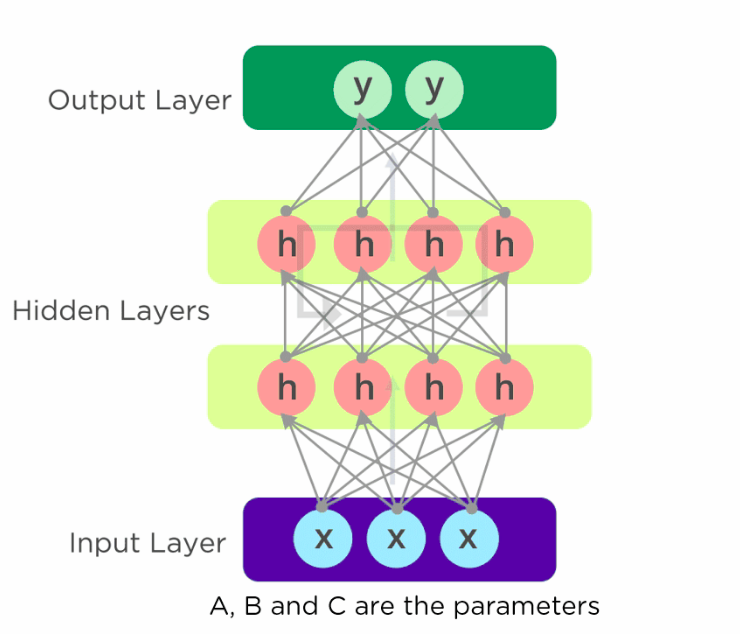
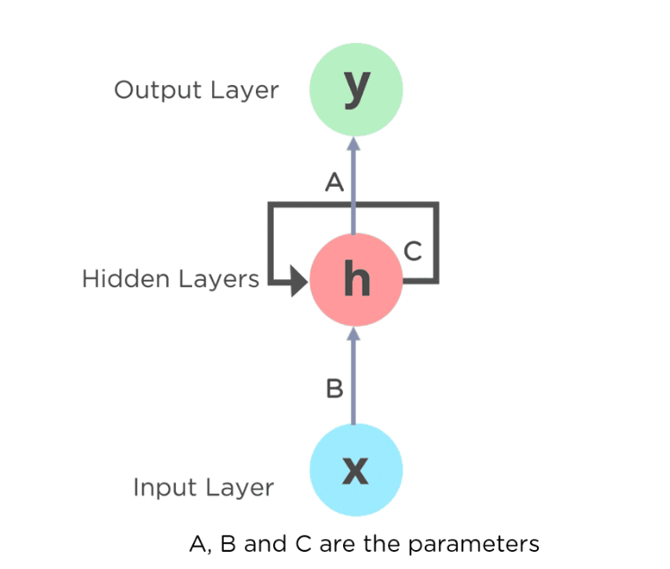

Data da publicação: 28/09/2021 
Tutorial escrito por Paula Luana Oliveira da Silva, graduanda em Ciência da Computação pela Universidade Federal do Ceará - Campus Quixadá.

# Introdução a Redes Neurais Recorrentes

[Assista o vídeo desse tutorial](https://youtu.be/Apgi1WQxNhM)

Antes de entendermos do que se trata as Redes Neurais Recorrentes, vamos contextualizar os tipos de problemas que elas resolvem. Depois disso, entederemos o que elas são e como funcionam. Mas daqui para frente vamos nos referir as Redes Neurais Recorrentes como RNN, já que sua tradução para o inglês é *Recurring Neural Networks*.

**Sumário**
1. Problemas resolvidos pelas RNN.
2. O que são as RNN e como elas funcionam?

## 1. Problemas resolvidos pelas RNN.
As RNN são muito boas quando se tratam de sequência, elas podem realizar predições relacionadas a essa temática. Por exemplo, em um filme uma RNN pode prever o tipo da ação de um determinado momento, dado que ela vem acompanhando o desenrolar das ações do filme. 

Um cenário mais comum no nosso dia a dia, é quando vamos realizar uma busca no Google e ele pode mostrar uma sugestão do que exatamente estamos procurando. Isso ocorre porque a RNN tem acesso a sequência de palavras mais recorrentes após as outras. Esse processo de prever a próxima palavra de um texto é o que chamamos de Processamento de Linguagem Natural.

 
Figura 1 - Pesquisa no Google

 
As RNN também podem gerar legendas em vídeos e realizar predições de quantos brasileiros estarão vacinados até uma determinada data. Interessante não é? Agora vamos entender o que são as RNN.

## 2. O que são as RNN e como elas funcionam?
Quando pesquisamos o que são as RNN no Google, o Wikipédia já mostra essa definição "Uma rede neural recorrente é uma classe de redes neurais artificiais em que as conexões entre os nós formam um gráfico direcionado ao longo de uma sequência temporal. Isso permite exibir comportamento dinâmico temporal". Vamos tentar destrinchar o que isso quer dizer.

### "Uma rede neural recorrente é uma classe de redes neurais artificiais..."
Vamos definir as redes neurais artificiais(RNA). As RNA, como seu próprio nome diz, é inspirada nas redes neurais de um cérebro humano, o príncio parte de imitar a forma como os neurônios biológicos se comunicam uns com os outros. Em sua estrutura, as RNA possuem camadas de nós, sendo elas: camada de entrada, camada oculta e camada de saída. Cada nó se conecta a outro e tem um peso e limite associados. Se a saída de qualquer nó individual estiver acima do valor limite especificado, esse nó será ativado, enviando dados para a próxima camada da rede. Caso contrário, nenhum dado é passado para a próxima camada da rede.

As RNA dependem de dados de treinamento para aprender e melhorar sua precisão ao longo do tempo. No entanto, uma vez que esses algoritmos de aprendizagem são ajustados para precisão, eles são ferramentas poderosas em ciência da computação e inteligência artificial , permitindo-nos classificar e agrupar dados em alta velocidade. 

[Quero entender mais sobre Redes neurais artificiais.](https://www.ibm.com/cloud/learn/neural-networks)

### "em que as conexões entre os nós formam um gráfico direcionado ao longo de uma sequência temporal. Isso permite exibir comportamento dinâmico temporal". 
Veja imagem a seguir, ela nos mostra um grafo direcionado e as camadas que mencionamos anteriormente. Esta forma é a mais detalhada de uma rede neural, mas podemos resumir sua estrutura como apresentado na Figura 3. 
[Veja o gif animado](https://www.simplilearn.com/ice9/free_resources_article_thumb/Network_framework.gif)

 
Figura 2 - A estrutura de uma Rede Neural

Repare que na Figura 3 que temos um loop mais explícito no nosso grafo. Nas Redes Neurais Recorrentes, apesar de trabalharmos com sequências, nós não guardamos as informações das informações para realizar as predições, o que fazemos é que dentro desse loop, a cada nó produzimos uma nova saída e a passamos para o nó seguinte. Dessa maneira, utilizando os loops, podemos fazer com que a informação persista sem gastar memória. Veja que, toda a sequência é importante, pois para prever o final de uma frase, a rede neural precisa saber o começo dela e isso funciona para todo problema que usamos a RNN, nesse sentido podemos concluir que, **para entender o final de um problema é preciso saber o que aconteceu antes.**

 
Figura 3 - A estrutura resumida de uma Rede Neural

Vamos finalizar por aqui, a ideia é que esse tutorial seja o mais simples possível para que sua comprenssão seja possível. Em breve estaremos resolvendo problemas com redes neurais recorrentes e você vai poder ver como são as RNN em código Python. Obrigada por ler até aqui! Até a próxima!

[Assista o vídeo desse tutorial](https://youtu.be/Apgi1WQxNhM)

## Referências

[Neural Networks](https://www.ibm.com/cloud/learn/neural-networks) 
[Redes Neurais | Redes Neurais Recorrentes](https://medium.com/turing-talks/turing-talks-26-modelos-de-predi%C3%A7%C3%A3o-redes-neurais-recorrentes-439198e9ecf3) 
[Introdução a Redes Neurais Recorrentes](https://www.youtube.com/watch?v=ZvBJxh5O3H0)

