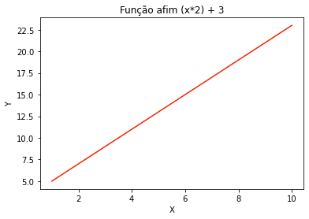
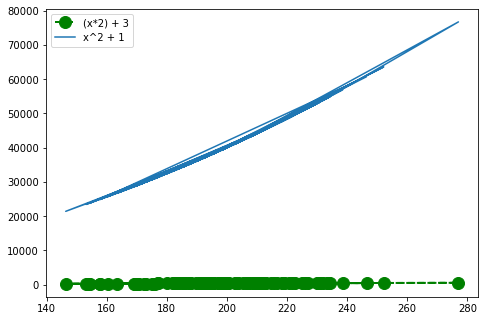
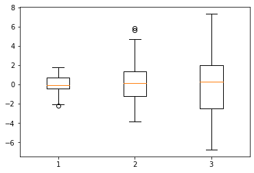
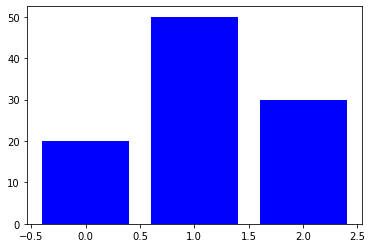

# _Introdução ao Matplotlib, personalização simples de gráficos._

As bibliotecas como o Pandas e Seaborn, possuem métodos de visualização de dados que partem da biblioteca Matplotlib, por isso há a importância do seu estudo, pois a Matplotlib possui recursos para a geração de gráficos 2D a partir de arrays. Seus gráficos são muito usados em Python nas áreas de processamento de imagem, processamento de sinal, aprendizado de máquina, pesquisa acadêmica, etc. O Matplotlib disponibiliza esses gráficos com alta qualidade e em diversos formatos, também permite sua personalização através da escolha do gráfico, escolha de marcadores, cores, criação de rótulos, textos, manipulação de dados, etc.

### Instalação
Se você possui a versão atualizada do Anaconda, então a biblioteca já está instalada.
Caso sua versão não esteja atualizada, acesse o site oficial do matplotlib e o instale de acordo com o sistema operacional que você usa.

link para instalação: https://matplotlib.org/stable/users/installing.html

### Mãos na massa
Vamos começar importando o numpy e o matplotlib.
```
import numpy as np
import matplotlib.pyplot as plt
%matplotlib inline
```
Perceba que estamos usando ```%matplotlib inline``` para poder mostrar os gráficos na mesma linha de comando em que os criaremos.

Agora, vamos criar o eixo x do gráfico, usando a função linspace, que está fazendo que com que o array comece com o inteiro 1 e termine no 10, mostrando os 10 primeiros números. Vamos usar o `astype (int)` para que os valores do array sejam inteiros, pois sem o uso do `astype (int)` eles serão float.
```
x = np.linspace(1, 10, 10).astype (int)
x
```
Para poder usar dois eixos nos nossos gráficos, vamos criar o eixo y, a partir da funçao afim 2x + 3
```
y = (2*x) + 3
y
```
### Modelo de código simples
Iniciaremos o estudo dos gráficos do matplotlib da maneira mais simples possível, a fim de facilitar sua compreensão.
```
plt.plot(x, y, '#f92200')
plt.xlabel('X')
plt.ylabel('Y')
plt.title('Função afim (x*2) + 3')
plt.show()
```


As funções que usamos e suas características
* plot: Faz uma representação gráfica de um conjunto de pontos com os dados que fornecemos. Passamos x, y e a cor que queremos que a linha do gráfico tenha.
* xlabel: Define um rótulo para o eixo x que vai aparacecer no gráfico.
* ylabel: Define um rótulo para o eixo y que vai aparacecer no gráfico.
* title: Define um título para o gráfico.
* show: Mostra o gráfico.

### Modelo de código personalizado
Com o modelo a seguir, podemos personalizar ainda mais nosso gráfico, pois estaremos usando orientação à objeto, o que permite que configuremos mais características do gráfico.
```
fig = plt.figure() #figura vazia

axes = fig.add_axes([0.1, 0.1, 0.8, 0.8]) #adicionando eixos à figura

#plota nos eixos
axes.plot(x, y, 'b')
axes.set_xlabel('Uma label para x')
axes.set_ylabel('Uma label para Y')
axes.set_title('Personalizando um gráfico matplotlib usando orientação a objeto')
```


Repore nos comentários do nosso código, eles estão descrevendo o que está acontecendo. Mas vamos resumir, criamos uma figura vazia, para só depois adicionar mais configurações a ela. Usando a função `add_axes`, adicionamos espaços dentro do gráfico. Com os dados passados a `add_axes([0.1, 0.1, 0.8, 0.8])`, fazemos com que o gráfico tenha respectivamente um espaçamento de 10% à esquerda, 10% em baixo, tenha uma largura de 80% e uma altura de 80%. 
Já quando começamos a aplicar funções no axes, fazemos o que já fizemos no modelo simples, só que com nomes de funções diferentes. Veja que usamos o comando set, o que normalmente usamos para mudar um dado quando estamos mexendo com orientação à objeto. Dessa forma, usar o `axes.set_xlabel`, `axes.set_ylabel` e o `axes.set_title` muda as informações que estão guardadas nos atributos.

**Gráfico com legenda**
Quando vemos gráficos, seja em livros, na Internet, em pesquisas; muitas vezes as legendas estão presentes, pois sua inclusão facilita a compreensão dos dados em que o gráfico representa. Po isso, vamos ver como incluir legendas em nossos gráficos.
```
fig = plt.figure()

ax = fig.add_axes([0,0,1,1])

ax.plot(x, (2*x) + 3, label="(2*x) + 3", color='green', marker='o', linestyle='dashed', linewidth=2, markersize=12)
ax.plot(x, x**2 + 1, label="x^2 + 1")
ax.legend()
```



Com esse código, criamos duas funções diferentes em nosso gráfico. 
* Em `ax.plot(x, (x*2) + 3, label="(x*2) + 3", color='green', marker='o', linestyle='dashed', linewidth=2, markersize=12)`:
  Passamos o x que declaramos lá no começo do nosso tutorial como o eixo x desse gráfico, já para o eixo y, declaramos uma função sobre os dados de x `(2*x) + 3`.
  Na label, declaramos a legenda que irá aparecer. Em color, a cor em que o resultado da função aparecerá no gráfico. No marker, é a marcação em que aparecerá nos   resultados da função, já markersize, é o seu tamanho. Linestyle, é definido o estilo da linha e linewidth é sua largura.
* Em `ax.plot(x, x**2 + 1, label="x^2 + 1")`: temos um exemplo simples. Para que você veja que não é uma necessidade mudar todas as características. Pois nessa     função só passamos o eixo x, o eixo y e um rótulo para essa representação.
* `ax.legend`: É a responsável por mostrar a legenda no gráfico.

### Alguns tipos de Plots

Nos gráficos a seguir, visualizaremos suas definições simples. Mas também podemos personalizá-los, assim como vimos no exemplo anterior. Caso deseje olhar quais características que estão disponíveis para alterar em cada função, tecle `Shift + Tab` em cima da função.

**Gráfico de dispersão**

O gráfico de dispersão é uma ferramenta poderosa para estudar a relação entre duas variáveis (normalmente contínuas)
```
plt.scatter(x,y)
```


**Boxplot**

O boxplot nos fornece uma análise visual da posição, dispersão, simetria, caudas e valores discrepantes (outliers) do conjunto de dados.
```
data = [np.random.normal(0, std, 100) for std in range(1, 4)]

plt.boxplot(data);     
```


**Histograma**

Um histograma consiste em um gráfico de barras que demonstra uma distribuição de frequências, onde a base de cada uma das barras representa uma classe, e a altura a quantidade ou frequência absoluta com que o valor da classe ocorre. Ao mesmo tempo, pode ser utilizado como um indicador de dispersão de processos.
```
y = [20,50,30]
x = range(len(y))

plt.bar(x, y, color='b')
plt.show()
```


### Referências
 
https://panda.ime.usp.br/algoritmos/static/algoritmos/10-matplotlib.html#:~:text=O%20matplotlib%20%C3%A9%20uma%20biblioteca,2D%20a%20partir%20de%20arrays.&text=O%20matplotlib%20pode%20ser%20conceitualmente,de%20c%C3%B3digo%20similar%20ao%20MATLAB.
https://operdata.com.br/blog/como-interpretar-um-boxplot/#:~:text=O%20boxplot%20nos%20fornece%20uma,a%20mediana%20ou%20segundo%20quartil).

#### Para acessar o material em vídeo:
[Introdução ao Matplotlib, personalização simples de gráficos.](https://www.youtube.com/watch?v=Bv0fMkLUtZM&t=21s)


