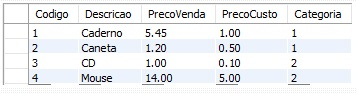
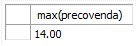
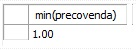
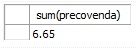
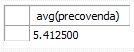
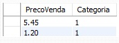
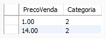
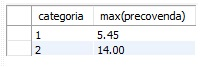
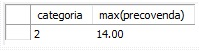
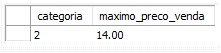

# Funções de Agregação e Agrupamento.

## Sintaxe:
Uma função de agregação processa um conjunto de valores contidos em uma única coluna de uma tabela e retorna um único valor como resultado. 

Podemos informar na listagem de colunas do comando SELECT uma ou mais funções de agregação, de acordo com a necessidade:

~~~sql
SELECT 
  [função(ões) de agregação(coluna(s))] 
FROM 
  [NOME DA TABELA]
~~~

## Tabela de Exemplo:
De modo a ajudar no entendimento iremos utilizar a tabela abaixo como exemplo a ser seguido.

## **Função MAX:**

A função MAX analisa um conjunto de valores e retorna o maior entre eles. No exemplo abaixo utilizamos essa função para encontrar o preço de venda mais alto:

~~~sql
SELECT 
  max(precovenda) 
FROM 
  produtos
~~~

Ao final da execução desse comando será retornado o valor 14.00, como mostra o resultado abaixo:

## **Função MIN:**

A função MIN analisa um grupo de valores e retorna o menor entre eles. No exemplo usaremos a função para saber o preço de venda mais baixo:

~~~sql
SELECT 
  min(precovenda)
FROM 
  produtos
~~~

Ao final da execução desse comando será retornado o valor 1.00, como mostra o resultado abaixo:

## **Função SUM:**

A função SUM realiza a soma dos valores em uma única coluna e retorna esse resultado. Para somar todos os preços de venda dos produtos de uma categoria específica, podemos utilizar essa função informando a coluna PrecoVenda, como será mostrado abaixo:

~~~sql
SELECT
  sum(precovenda)
FROM
  produtos
WHERE
  categoria = 1
~~~

Ao final da execução desse comando será retornado o valor 6.65, como mostra o resultado abaixo:

* Por padrão a função **SUM** ignora valores do tipo **NULL .**

## **Função AVG:**

A função AVG podemos calcular a média aritmética dos valores em uma única coluna. Usamos essa função no exemplo a seguir, tomando como parâmetro a coluna PrecoVenda da tabela produtos.

~~~sql
SELECT
  avg(precovenda)
FROM
  produtos
~~~

Ao final da execução desse comando será retornado o valor aproximado 5.41, como mostra o resultado abaixo:

* Por padrão a função **AVG** ignora valores do tipo **NULL .**

## **Função COUNT:**

A função COUNT retorna o total de linhas selecionadas. Ela pode receber por parâmetro o nome da coluna ou um asterisco. 

* Por padrão, quando informado o nome de uma coluna, valores do tipo **NULL** são ignorados, mas quando informado * todas as linhas serão contabilizadas.

Para sabermos o total de produtos em uma categoria, podemos escrever uma consulta como esta:

~~~sql
SELECT
  count(precovenda)
FROM
  produtos
WHERE
  categoria = 1
~~~

## **Função GROUP BY:**

Ao utilizar a cláusula GROUP BY dividimos os registros que serão agregados em grupos de valores. Essa mudança faz com que tenhamos mais de uma linha como resultado, pois o processamento será realizado uma vez sobre cada um desses grupos.

Para sabermos o produto com maior valor de venda de cada categoria, podemos escrever uma consulta como esta:

~~~sql
SELECT
  categoria,
  max(precovenda)
FROM
  produtos
GROUP BY 
  categoria
~~~

Considerando a tabela criada de exemplo, quando essa consulta for executada os dados que aparecerão serão divididos em dois grupos, um para cada categoria, como mostra o resultado abaixo:

**Categoria 01:**

**Categoria 02:**

Logo após, a função MAX será aplicada uma vez para cada um desses grupos, fazendo com que tenhamos como resultado essa tabela abaixo:

**Função MAX aplicada:**

## **Função HAVING:**

Podemos usar a cláusula HAVING em conjunto com GROUP BY para filtrar os resultado que serão submetidos a agregação.

Vemos um exemplo desse filtro na consulta abaixo, que lista o maior preço de venda de cada categoria, incluindo apenas os produtos com preço de venda maior que 10:

~~~sql
SELECT
  categoria,
  max(precovenda)
FROM
  produtos
GROUP BY 
  categoria
HAVING 
  max(precovenda) > 10
~~~

Ao final da execução desse comando será retornado o valor, como mostra o resultado abaixo:

## **Função ALIAS:**

Com o intuíto de facilitar a compreensão do SQL, podemos utilizar a palavra-chave **_as_** para criar um apelido para uma coluna. Uma vez que as funções de agregação são retornadas como tal, também podemos fazer uso desse recurso como exemplificado a seguir:

~~~sql
SELECT
  categoria,
  max(precovenda) as maximo_preco_venda
FROM
  produtos
GROUP BY 
  categoria
HAVING 
  max(precovenda) > 10
~~~

Ao final da execução desse código teremos a coluna maximo_preco_venda contendo o maior preço de venda, como mostra o resultado abaixo:

### Com isso terminamos a parte de Funções de Agregação e Agrupamento.

### Para poder ver o vídeo de referência a esse texto clique [aqui](https://youtu.be/2HC-yDvXCew). 
