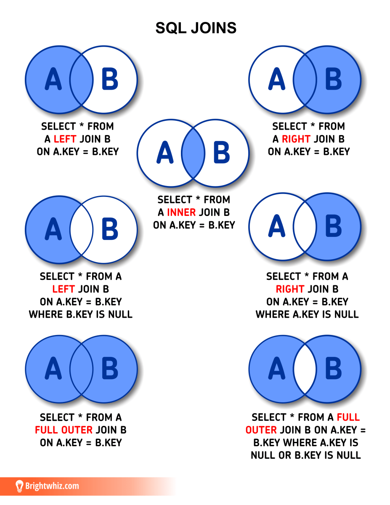

# Junções SQL

### Introdução

É impossível deixar todos os dados que se conectam em uma tabela só. Em um banco de dados relacional, as tabelas se interligarão por indicadores que apontam para um valor específico em outras tabelas (chaves estrangeiras). O que as cláusulas de junção (**joins**) fazem, de maneira simplificada, é seguir a trilha entre as tabelas, ver onde elas se conectam e juntar as informações de maneira lógica em uma consulta só.

> **Um JOIN é um meio de combinar colunas de uma (auto-junção) ou mais tabelas, usando valores comuns a cada uma delas. O SQL padrão ANSI especifica cinco tipos de JOIN: INNER JOIN, LEFT JOIN, RIGHT JOIN, FULL JOIN e CROSS JOIN.**

### INNER JOIN

> **SELECT** * **FROM** tabelaA **INNER JOIN** tabelaB **ON** tabelaA.key = tabelaB.key;

Esta consulta retorna todas as linhas que satisfazem a condição de junção (**ON** tabelaA.key = tabelaB.key;), juntando as linhas onde a condição é verdadeira em uma nova linha com todas as colunas selecionadas de ambas as tabelas.

Exemplo:

<table border="1" cellspacing="0" cellpadding="5" bordercolor="#000000">
<tr>
	<td><strong>nome_produto</strong></td>
	<td><strong>preço</strong></td>
 <td><strong>quantidade</strong></td>
 <td><strong>id_fornecedor</strong></td>
 <td><strong>id</strong></td>
</tr>
<tr>
	<td>Nescau</td>
	<td>3.50</td>
 <td>65</td>
 <td>5</td>
 <td>0</td>
</tr>
 <tr>
	<td>Leite Moça</td>
	<td>6.50</td>
 <td>41</td>
 <td>5</td>
 <td>1</td>
</tr>
 <tr>
	<td>Pão Árabe</td>
	<td>5.99</td>
 <td>20</td>
 <td>4</td>
 <td>2</td>
</tr>
 </table>
 
 <table border="1" cellspacing="0" cellpadding="5" bordercolor="#000000">
<tr>
	<td><strong>nome_fornecedor</strong></td>
	<td><strong>cidade</strong></td>
 <td><strong>id</strong></td>
</tr>
<tr>
	<td>Nestlé</td>
	<td>São Paulo</td>
 <td>5</td>
</tr>
 <tr>
	<td>Panificadora Local</td>
	<td>Quixadá</td>
 <td>4</td>
</tr>
 </table>
 
 > **SELECT** nome_produto, nome_fornecedor **FROM** produto INNER JOIN fornecedor ON produto.id_fornecedor = fornecedor.id;

<table border="1" cellspacing="0" cellpadding="5" bordercolor="#000000">
<tr>
	<td><strong>nome_produto</strong></td>
	<td><strong>nome_fornecedor</strong></td>
</tr>
<tr>
	<td>Nescau</td>
	<td>Nestle</td>
</tr>
 <tr>
	<td>Leite Moça</td>
	<td>Nestlé</td>
</tr>
 <tr>
	<td>Pão Árabe</td>
	<td>Panificadora Local</td>
</tr>
 </table>

### RIGHT JOIN

> **SELECT** * **FROM** tabelaA **LEFT JOIN** tabelaB **ON** tabelaA.key = tabelaB.key;

Retorna todos os registros da tabela à esquerda (no exemplo acima, a tabela A) e os registros que possuem correspondência na tabela da direita, substituindo por **NULL** os valores em linhas que não atendem à condição de junção.

Exemplo:

<table border="1" cellspacing="0" cellpadding="5" bordercolor="#000000">
<tr>
	<td><strong>nome_produto</strong></td>
	<td><strong>preço</strong></td>
 <td><strong>quantidade</strong></td>
 <td><strong>id_fornecedor</strong></td>
 <td><strong>id</strong></td>
</tr>
<tr>
	<td>Nescau</td>
	<td>3.50</td>
 <td>65</td>
 <td>5</td>
 <td>0</td>
</tr>
 <tr>
	<td>Leite Moça</td>
	<td>6.50</td>
 <td>41</td>
 <td>5</td>
 <td>1</td>
</tr>
 <tr>
	<td>Pão Árabe</td>
	<td>5.99</td>
 <td>20</td>
 <td>4</td>
 <td>2</td>
</tr>
 </table>
 
 <table border="1" cellspacing="0" cellpadding="5" bordercolor="#000000">
<tr>
	<td><strong>nome_fornecedor</strong></td>
	<td><strong>cidade</strong></td>
 <td><strong>id</strong></td>
</tr>
<tr>
	<td>Nestlé</td>
	<td>São Paulo</td>
 <td>5</td>
</tr>
 <tr>
	<td>Panificadora Local</td>
	<td>Quixadá</td>
 <td>4</td>
</tr>
 <tr>
<td>Sadia</td>
<td>Rio de Janeiro</td>
 <td>3</td>
</tr>
 </table>
 
 
> **SELECT** fornecedor.nome as nome_fornecedor, produto.nome as nome_produto **FROM** fornecedor **LEFT JOIN** produto **ON** fornecedor.id = produto.id;

<table border="1" cellspacing="0" cellpadding="5" bordercolor="#000000">
<tr>
	<td><strong>nome_fornecedor</strong></td>
	<td><strong>nome_produto</strong></td>
</tr>
<tr>
	<td>Nestlé</td>
	<td>Nescau</td>
</tr>
 <tr>
	<td>Nestlé</td>
	<td>Leite Moça</td>
</tr>
 <tr>
	<td>Panificadora Local</td>
	<td>Pão Árabe</td>
</tr>
<tr>
	<td>Sadia</td>
	<td>NULL</td>
</tr>
 </table>
 
 ### RIGHT JOIN
 
 Com o conceito muito parecido com o **LEFT JOIN**, mas, ao invés de exibir todos os registros da esquerda, exibe todos os registros da tabela da direita, deixando os itens sem correspondência à esquerda nulos;
 
Exemplo:

<table border="1" cellspacing="0" cellpadding="5" bordercolor="#000000">
<tr>
	<td><strong>nome_produto</strong></td>
	<td><strong>preço</strong></td>
 <td><strong>quantidade</strong></td>
 <td><strong>id_fornecedor</strong></td>
 <td><strong>id</strong></td>
</tr>
<tr>
	<td>Nescau</td>
	<td>3.50</td>
 <td>65</td>
 <td>5</td>
 <td>0</td>
</tr>
 <tr>
	<td>Leite Moça</td>
	<td>6.50</td>
 <td>41</td>
 <td>5</td>
 <td>1</td>
</tr>
 <tr>
	<td>Pão Árabe</td>
	<td>5.99</td>
 <td>20</td>
 <td>4</td>
 <td>2</td>
</tr>
 </table>
 
 <table border="1" cellspacing="0" cellpadding="5" bordercolor="#000000">
<tr>
	<td><strong>nome_fornecedor</strong></td>
	<td><strong>cidade</strong></td>
 <td><strong>id</strong></td>
</tr>
<tr>
	<td>Nestlé</td>
	<td>São Paulo</td>
 <td>5</td>
</tr>
 <tr>
	<td>Panificadora Local</td>
	<td>Quixadá</td>
 <td>4</td>
</tr>
 <tr>
<td>Sadia</td>
<td>Rio de Janeiro</td>
 <td>3</td>
</tr>
 </table>
 
 
> **SELECT** produto.nome as nome_produto, fornecedor.nome as nome_fornecedor **FROM** produto **RIGHT JOIN** fornecedor **ON** produto.id = fornecedor.id;

<table border="1" cellspacing="0" cellpadding="5" bordercolor="#000000">
<tr>
	<td><strong>nome_produto</strong></td>
	<td><strong>nome_fornecedor</strong></td>
</tr>
<tr>
	<td>Nescau</td>
	<td>Nestlé</td>
</tr>
 <tr>
	<td>Leite Moça</td>
	<td>Nestlé</td>
</tr>
 <tr>
	<td>Pão Árabe</td>
	<td>Panificadora Local</td>
</tr>
<tr>
	<td>NULL</td>
	<td>Sadia</td>
</tr>
 </table>

### FULL JOIN ou OUTER JOIN

Este é simplesmente uma combinação entre o **RIGHT JOIN** e o **LEFT JOIN**, retornando todos os registros duas tabelas.

> **SELECT** <select_list> **FROM** Tabela A **FULL JOIN** Tabela B **ON** A.Key = B.Key

Exemplo:

<table border="1" cellspacing="0" cellpadding="5" bordercolor="#000000">
<tr>
	<td><strong>nome_produto</strong></td>
	<td><strong>preço</strong></td>
 <td><strong>quantidade</strong></td>
 <td><strong>id_fornecedor</strong></td>
 <td><strong>id</strong></td>
</tr>
<tr>
	<td>Nescau</td>
	<td>3.50</td>
 <td>65</td>
 <td>5</td>
 <td>0</td>
</tr>
 <tr>
	<td>Leite Moça</td>
	<td>6.50</td>
 <td>41</td>
 <td>5</td>
 <td>1</td>
</tr>
 <tr>
	<td>Pão Árabe</td>
	<td>5.99</td>
 <td>20</td>
 <td>4</td>
 <td>2</td>
</tr>
	
 <tr>
	<td>Pão de Queijo</td>
	<td>3.50</td>
 <td>20</td>
 <td>NULL</td>
 <td>3</td>
</tr>
 </table>
 
 <table border="1" cellspacing="0" cellpadding="5" bordercolor="#000000">
<tr>
	<td><strong>nome_fornecedor</strong></td>
	<td><strong>cidade</strong></td>
 <td><strong>id</strong></td>
</tr>
<tr>
	<td>Nestlé</td>
	<td>São Paulo</td>
 <td>5</td>
</tr>
 <tr>
	<td>Panificadora Local</td>
	<td>Quixadá</td>
 <td>4</td>
</tr>
 <tr>
<td>Sadia</td>
<td>Rio de Janeiro</td>
 <td>3</td>
</tr>
 </table>
 
> **SELECT** produto.nome as nome_produto, fornecedor.nome as nome_fornecedor **FROM** produto **FULL JOIN** fornecedor **ON** produto.id = fornecedor.id;

<table border="1" cellspacing="0" cellpadding="5" bordercolor="#000000">
<tr>
	<td><strong>nome_produto</strong></td>
	<td><strong>nome_fornecedor</strong></td>
</tr>
<tr>
	<td>Nescau</td>
	<td>Nestlé</td>
</tr>
 <tr>
	<td>Leite Moça</td>
	<td>Nestlé</td>
</tr>
 <tr>
	<td>Pão Árabe</td>
	<td>Panificadora Local</td>
</tr>
 <tr>
	<td>Pão de Queijo</td>
	<td>NULL</td>
</tr>
<tr>
	<td>NULL</td>
	<td>Sadia</td>
</tr>
 </table>
 
 ### CROSS JOIN
 
 O **CROSS JOIN** faz uma espécie de plano cartesiano, listando todas as correspondências de cada linha da tabela à esquerda de maneira sequencial. Para que o **CROSS JOIN** funcione, é obrigatório que exista ao menos uma chave interligando as duas tabelas, já que este não vem com uma condição de junção que pode ser alterada.
 
 > **SELECT** <select_list> **FROM** Tabela A **CROSS JOIN** Tabela B

Exemplo:

<table border="1" cellspacing="0" cellpadding="5" bordercolor="#000000">
<tr>
	<td><strong>nome_produto</strong></td>
	<td><strong>preço</strong></td>
 <td><strong>quantidade</strong></td>
 <td><strong>id_fornecedor</strong></td>
 <td><strong>id</strong></td>
</tr>
<tr>
	<td>Nescau</td>
	<td>3.50</td>
 <td>65</td>
 <td>5</td>
 <td>0</td>
</tr>
 <tr>
	<td>Leite Moça</td>
	<td>6.50</td>
 <td>41</td>
 <td>5</td>
 <td>1</td>
</tr>
 <tr>
	<td>Pão Árabe</td>
	<td>5.99</td>
 <td>20</td>
 <td>4</td>
 <td>2</td>
</tr>	
 <tr>
	<td>Pão de Queijo</td>
	<td>3.50</td>
 <td>20</td>
 <td>NULL</td>
 <td>3</td>
</tr>
 <tr>
	<td>Neston</td>
	<td>6.50</td>
 <td>41</td>
 <td>5</td>
 <td>4</td>
</tr>
 </table>
 
 <table border="1" cellspacing="0" cellpadding="5" bordercolor="#000000">
<tr>
	<td><strong>nome_fornecedor</strong></td>
	<td><strong>cidade</strong></td>
 <td><strong>id</strong></td>
</tr>
<tr>
	<td>Nestlé</td>
	<td>São Paulo</td>
 <td>5</td>
</tr>
 <tr>
	<td>Panificadora Local</td>
	<td>Quixadá</td>
 <td>4</td>
</tr>
 <tr>
<td>Sadia</td>
<td>Rio de Janeiro</td>
 <td>3</td>
</tr>
 </table>
 
 > **SELECT** fornecedor.nome as nome_fornecedor, produto.nome as nome_produto **FROM** fornecedor **CROSS JOIN** produto

<table border="1" cellspacing="0" cellpadding="5" bordercolor="#000000">
<tr>
	<td><strong>nome_produto</strong></td>
	<td><strong>nome_fornecedor</strong></td>
</tr>
<tr>
	<td>Nestlé</td>
	<td>Nescau</td>
</tr>
 <tr>
	<td>Nestlé</td>
	<td>Leite Moça</td>
</tr>
 <tr>
	<td>Nestlé</td>
	<td>Neston</td>
</tr>
 <tr>
	<td>Panificadora Local</td>
	<td>Pão Árabe</td>
</tr>
 </table>

### Resumo e Conclusão

Segue um diagrama que resume bem todo o assunto.

Saber utilizar junções é essencial quando se trabalha com bancos de dados, eliminando diversas necessidades de intervenção de aplicações externas e da realização de várias consultas seguidas ao simplesmente juntar tabelas de maneira eficiente.

### Fontes:
> https://www.alura.com.br/artigos/join-em-sql?gclid=CjwKCAjwp7eUBhBeEiwAZbHwkS2P7pzAUPexLtZD-xiNm8R_qNrtdC3WRriCy61UmfgUorlZ27Xw1RoCy2wQAvD_BwE
> 
> https://www.w3schools.com/sql/sql_join.asp
> 
> Pinterest
